# PythonもR言語もないデータサイエンス・AIの本
## 〜概念と物語で理解するデータの科学と人工知能〜

![表紙イメージ]

## 目次

- [はじめに](#はじめに)
- [第1章：データサイエンスとAIの歴史](#第1章データサイエンスとaiの歴史)
- [第2章：データの理解と前処理の世界](#第2章データの理解と前処理の世界)
- [第3章：機械学習の基礎概念](#第3章機械学習の基礎概念)
- [第4章：ディープラーニングと神経網](#第4章ディープラーニングと神経網)
- [第5章：自然言語処理と言語モデル](#第5章自然言語処理と言語モデル)
- [第6章：コンピュータビジョンとイメージ処理](#第6章コンピュータビジョンとイメージ処理)
- [第7章：生成AI革命](#第7章生成ai革命)
- [第8章：データサイエンスとAIの倫理と未来](#第8章データサイエンスとaiの倫理と未来)
- [おわりに：コードなき未来のデータサイエンス](#おわりにコードなき未来のデータサイエンス)
- [付録：データサイエンス・AI学習のためのリソースガイド](#付録データサイエンスai学習のためのリソースガイド)

---

## はじめに

「データサイエンスやAIを学びたいなら、まずはPythonかRを習得しなければならない」

このような考えが、多くの人々がデータサイエンスやAIの学習を始める前に大きな壁となっています。確かに、実務でデータサイエンスやAIを実践するには、何らかのプログラミング言語の知識が必要になるでしょう。しかし、その基本的な概念や考え方、歴史的背景、そして応用可能性を理解するためには、必ずしもコードを書く必要はありません。

本書「PythonもR言語もないデータサイエンス・AIの本」は、プログラミングコードを一切使わずに、データサイエンスとAIの世界を探索する旅にあなたを招待します。数式の詳細よりも、概念の直感的理解と実世界での応用に焦点を当て、データから知見を得るプロセスとAIの可能性について解説します。

データサイエンスやAIに興味はあるけれどプログラミングには抵抗がある方、技術的な詳細よりもビジネスでの活用方法を知りたい経営者や意思決定者、あるいはこれからの社会を形作る技術を理解したい一般の方々に向けて、本書はデータとAIの物語を紡ぎます。

コードの代わりに、図表、事例、歴史的背景、そして専門家の洞察を通じて、データサイエンスとAIの世界をわかりやすく解説します。本書を読み終えた時、あなたはプログラミング言語を一行も書くことなく、データサイエンスとAIの基本的な考え方と可能性を理解し、それらを自分の領域でどう活かせるかについての洞察を得ているでしょう。

さあ、プログラミングコードなしでデータとAIの旅に出かけましょう。

---

## 第1章：データサイエンスとAIの歴史

### 1.1 データ分析の起源：統計学の誕生から現代まで

データサイエンスの歴史は、人類が数を数え始めた時から始まったと言っても過言ではありません。しかし、より体系的なデータ分析の起源は、17世紀の統計学の誕生に遡ります。

統計学という言葉は、「国家の状態」を意味するラテン語「status」に由来しています。初期の統計学は、主に国勢調査や税金徴収のためのデータ収集と分析に焦点を当てていました。

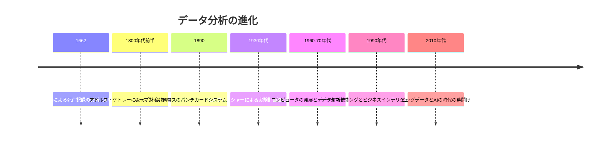

20世紀後半になると、コンピュータの発展により大量のデータを処理できるようになり、データ分析の可能性が飛躍的に広がりました。2010年代に入ると、「ビッグデータ」という言葉が流行し、従来の手法では扱いきれない膨大なデータを分析する技術とその価値に注目が集まりました。

> **ベテランの知恵袋**：データサイエンスの最も重要な教訓の一つは、「相関関係は因果関係を意味しない」ということです。例えば、アイスクリームの売上とプールでの溺死事故の間には強い相関関係がありますが、アイスクリームが溺死事故の原因ではありません。両方とも夏の気温上昇という第三の要因に影響されているのです。真の洞察を得るためには、データの関係性だけでなく、その背後にあるメカニズムを理解する必要があります。この原則は300年前の統計学の誕生時から変わっていませんし、AIが発達した現代でも同様に重要です。

### 1.2 人工知能の夢：初期の構想から現実へ

人工知能（AI）の概念は、古代の神話や伝説にまで遡ることができます。しかし、現代的な意味でのAIの始まりは、1950年代に見ることができます。

1950年、アラン・チューリングは「コンピューティングマシンと知能」という論文で、後に「チューリングテスト」として知られるようになる思考実験を提案しました。この実験では、人間の審査員が、見えない相手（人間かコンピュータのどちらか）との文字対話を通じて、その相手が人間かコンピュータかを判断するというものでした。

1956年のダートマス会議で「人工知能」という用語が初めて正式に使用され、AIという研究分野が誕生しました。初期のAI研究者たちは楽観的で、人間レベルの知能を持つマシンが数十年以内に実現すると考えていました。

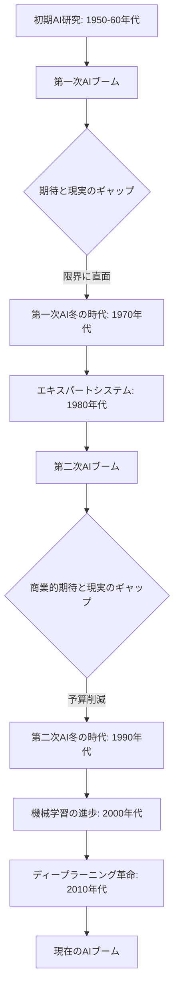

しかし、初期の高い期待は現実の困難に直面し、1970年代と1990年代には「AI冬の時代」と呼ばれる研究資金と興味の低下の時期がありました。

> **コラム：IBMのディープブルーと人間の挑戦**
> 
> 1997年5月11日、チェスの世界チャンピオンだったガルリ・カスパロフがIBMのスーパーコンピュータ「ディープブルー」に敗れるという歴史的な出来事が起こりました。この対戦は、人間とAIの関係性について多くの議論を引き起こしました。
> 
> 興味深いのは、ディープブルーは現代の機械学習とは全く異なるアプローチを使っていたことです。膨大な計算能力と事前にプログラムされたチェスの戦略を組み合わせた「ブルートフォース」手法でした。
> 
> カスパロフはその後、「マシンが私に勝ったのではなく、人間のチームとマシンの組み合わせが私に勝ったのだ」と述べています。この洞察は、現代のAI活用においても重要です。最も強力なアプローチは、人間とAIがそれぞれの強みを生かして協働することかもしれません。

### 1.3 ビッグデータの時代：データサイエンスの誕生

2010年前後から、「ビッグデータ」という言葉が注目されるようになりました。スマートフォンの普及、ソーシャルメディアの台頭、IoTデバイスの増加により、かつてないほど大量のデータが生成されるようになったのです。

ビッグデータは一般的に「3V」で特徴づけられます：

1. **Volume（量）**: 膨大な量のデータ
2. **Velocity（速度）**: データが生成・流入する速度
3. **Variety（多様性）**: 構造化・非構造化を含む様々な種類のデータ

その後、**Veracity（正確性）**と**Value（価値）**が加えられ、「5V」になりました。

このビッグデータの時代に、「データサイエンティスト」という職業が注目されるようになりました。ハーバード・ビジネスレビューは2012年に、データサイエンティストを「21世紀で最もセクシーな職業」と評しました。

> **若手の疑問解決**：
> 
> Q: データサイエンスとデータ分析の違いは何ですか？
> 
> A: これはよく混同される概念です。簡単に言えば、データ分析は「何が起きたか」を説明することに重点を置きますが、データサイエンスはさらに一歩進んで「なぜ起きたか」「次に何が起きるか」を予測し、そこから意思決定や自動化につなげることを目指します。スキルセットで見ると、データ分析者は主に統計とビジネスインテリジェンスのスキルを持ちますが、データサイエンティストはそれに加えて機械学習や高度なプログラミング、場合によってはビジネスドメインの深い知識を持っています。ただし、実務では両者の境界は曖昧で、多くの組織では役割が重複していることも珍しくありません。

### 1.4 機械学習の台頭：AIの新たなパラダイム

AIの歴史の中で大きなパラダイムシフトとなったのが、ルールベースのシステムから機械学習アプローチへの移行です。

初期のAIシステムは、人間の専門家が明示的に定義したルールに基づいて動作する「エキスパートシステム」でした。これは特定の狭い領域では効果的でしたが、複雑な現実世界の問題に対応するためには、数え切れないほどのルールが必要になるという限界がありました。

一方、機械学習では、システムは明示的なプログラミングなしにデータから学習します。これにより、人間がすべてのケースを予測してルールを作成する必要がなくなりました。


> **プロジェクト事例**：2001年、米国の大手小売チェーンTargetは、顧客の購買パターンから妊娠を予測するモデルを開発しました。このモデルは、妊婦の購買行動（無香料ローション、ミネラルサプリメントなど）のパターンを学習し、将来の両親に的を絞ったマーケティングを可能にしました。しかし、このプロジェクトは批判も受けました。あるケースでは、10代の娘の妊娠を、父親が店からのベビー用品のクーポンで知ることになったのです。この事例は、機械学習の強力な予測能力と同時に、その使用における倫理的考慮の重要性を示しています。Targetはその後、予測モデルの使用方法を修正し、対象商品をランダムな商品と混ぜて表示するようにマーケティング戦略を変更しました。

2010年代に入ると、コンピューティングパワーの増加、大量のデータの利用可能性、アルゴリズムの改良により、機械学習、特にディープラーニングが劇的な進歩を遂げました。これにより、画像認識、自然言語処理、音声認識などの分野で人間に匹敵する（場合によっては上回る）性能を達成することが可能になりました。

---

## 第2章：データの理解と前処理の世界

### 2.1 データの種類と構造：情報の多様な形態

データサイエンスとAIの世界では、様々な種類と構造のデータを扱います。データの種類を理解することは、適切な分析手法を選択するための第一歩です。

まず、データは大きく「構造化データ」と「非構造化データ」に分類できます：

- **構造化データ**: 定義された形式で整理されたデータ（例：データベースの表、スプレッドシート）
- **非構造化データ**: 定型化されていないデータ（例：テキスト文書、画像、音声、動画）
- **半構造化データ**: 構造化と非構造化の中間（例：JSONファイル、XMLドキュメント）

また、データは測定スケールによっても分類されます：

- **名義尺度（Nominal）**: カテゴリを表すだけのデータ（例：性別、国籍）
- **順序尺度（Ordinal）**: 順序があるカテゴリデータ（例：学歴、顧客満足度）
- **間隔尺度（Interval）**: 等間隔で、絶対的なゼロ点がないデータ（例：温度（℃））
- **比例尺度（Ratio）**: 等間隔で、絶対的なゼロ点があるデータ（例：身長、体重、金額）

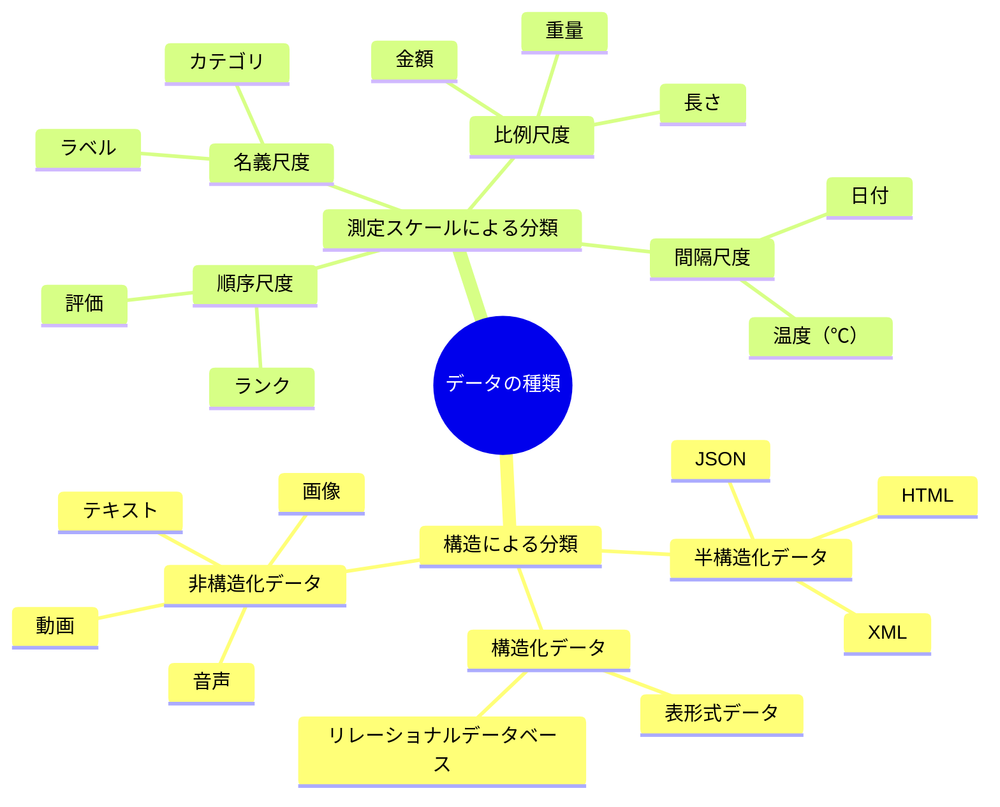

> **ベテランの知恵袋**：データサイエンスで最も重要なスキルの一つは、データの「感覚」を養うことです。数字の羅列を見て、そこにパターンや異常値を直感的に感じ取る能力が、分析の質を大きく左右します。優れたデータサイエンティストは、分析ツールを使い始める前に、まずデータを「観察」します。簡単な要約統計量を確認し、いくつかのデータポイントを詳細に調べ、可能であれば視覚化して全体像を把握します。これは芸術家が筆を取る前にキャンバスを観察するようなものです。この「データとの対話」の段階を省略せず、データが語る物語に耳を傾けることが、洞察への近道となります。

### 2.2 データの前処理：分析の成功を左右する重要工程

データサイエンスのプロジェクトでは、実際の分析や機械学習モデルの構築よりも、データの前処理に多くの時間が費やされます。「データサイエンティストの80%の時間はデータの準備に費やされる」という業界の格言があるほどです。

データの前処理には、以下のような作業が含まれます：

1. **データクリーニング**: 欠損値の処理、外れ値の検出と処理、重複データの削除
2. **データ変換**: スケーリング、正規化、カテゴリ変数のエンコーディング
3. **特徴量エンジニアリング**: 既存の特徴から新しい特徴を作成
4. **データ統合**: 複数のデータソースの統合
5. **データ削減**: データ量を減らすための次元削減やサンプリング


> **失敗から学ぶ**：2016年、ある金融テクノロジースタートアップは、顧客の信用スコアを予測するためのAIモデルを開発していました。数ヶ月の開発とテストの後、モデルは本番環境で導入されましたが、予測精度が著しく低下するという問題が発生しました。調査の結果、トレーニングデータにおける重要な欠損値の処理方法に問題があることが判明しました。データには「年収」の欠損値が多く含まれており、これを単純に中央値で置き換えていました。しかし、データをより詳細に分析すると、これらの欠損値はランダムではなく、特定の顧客セグメント（自営業者など）に偏っていたのです。この教訓から、欠損値は単に技術的な問題ではなく、重要なビジネス情報を含んでいる可能性があることを学びました。同社はデータ前処理戦略を見直し、欠損値自体を有意義な特徴として扱うアプローチを採用しました。

### 2.3 探索的データ分析：データの物語を読み解く

探索的データ分析（EDA）は、データサイエンスプロジェクトの重要な初期段階です。EDAPはデータの特性、パターン、関係性を理解するためのプロセスで、主に視覚化と要約統計を使用します。

EDAPの主な目的には以下があります：

- データの分布、中心傾向、分散を理解する
- 変数間の関係を特定する
- 異常値や欠損パターンを検出する
- 仮説を形成し、分析の方向性を決定する
- データの問題を早期に発見する

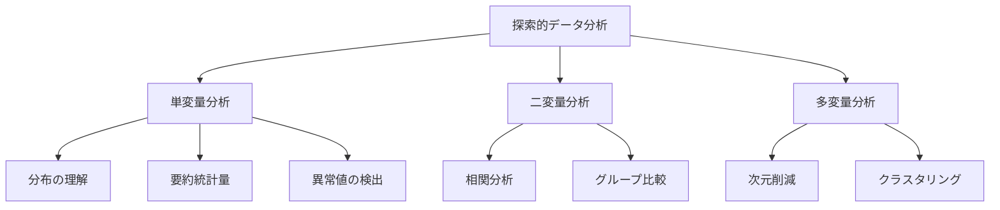

> **コラム：アンスコムの例**
> 
> 統計学者フランシス・アンスコムは1973年、「アンスコムの例」として知られる4つのデータセットを作成しました。これらのデータセットは、平均、分散、相関係数、回帰直線などの標準的な統計量がすべて同じです。しかし、データを視覚化すると、まったく異なるパターンが現れます。一つは直線的な関係、もう一つは完全な2次曲線、3つ目は直線的だが外れ値が一つある、4つ目はほぼ垂直な線と一つのデータポイントだけが影響力を持っています。
> 
> この例は、数値的な要約だけでなく、データの視覚化の重要性を強調しています。現代のデータサイエンスにおいても、この教訓は依然として重要です。データを「見る」ことで、数字だけでは見えないパターンや関係性が明らかになります。

### 2.4 データの可視化：洞察を導く視覚的思考法

データの可視化は、複雑なデータセットを理解し、パターンや傾向を発見し、結果を効果的に伝えるための強力なツールです。グラフや図表は、数字の羅列よりも人間の脳で処理しやすいため、データからの洞察を得るのに非常に効果的です。

効果的なデータ可視化のためのガイドラインには、以下のようなものがあります：

1. **目的を明確にする**: 可視化の目的（探索、説明、説得）を明確にする
2. **適切なグラフタイプを選択する**: データの性質と表現したい関係に合わせる
3. **シンプルに保つ**: 必要な情報だけを表示し、「データインク比」を最大化する
4. **適切な色と形を使用する**: 色覚異常の人にも配慮し、意味のある色コードを使用する
5. **文脈を提供する**: 適切なラベル、タイトル、凡例を付け、誤解を避ける

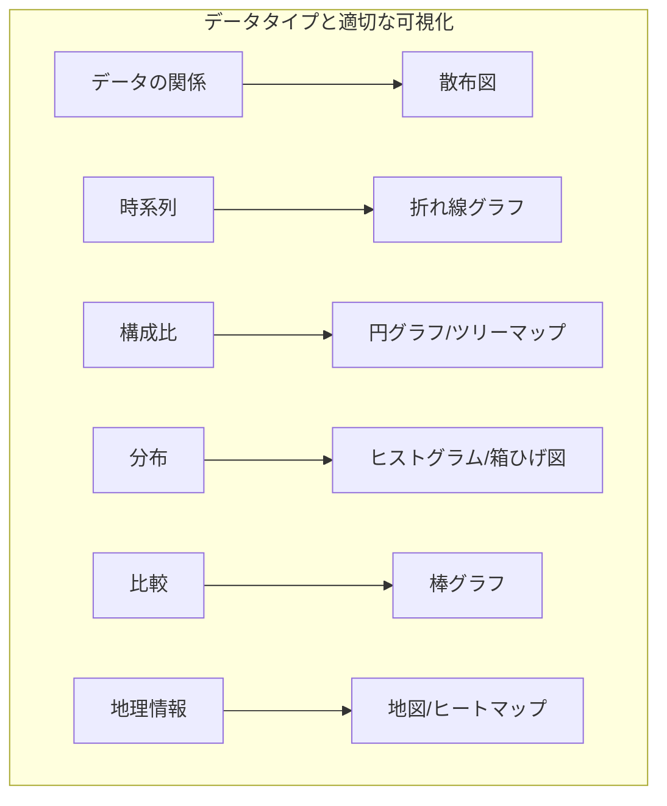

> **若手の疑問解決**：
> 
> Q: データ可視化でよくある間違いは何ですか？
> 
> A: データ可視化でよくある間違いはいくつかあります。まず、適切でないグラフタイプの選択（例：時系列データに円グラフを使う）。次に、誤解を招くようなY軸のカット（ゼロから始めないことで、差異が誇張される）。また、色の過剰使用や意味のない色の使用も問題です。3D効果の不必要な使用は、データの読み取りを難しくします。さらに、文脈情報の欠如（適切なラベル、単位、情報源の表示がない）も理解を妨げます。良い可視化は、直感的で誤解を招かず、データの真実を明確に伝えるものであることを心掛けましょう。

---

## 第3章：機械学習の基礎概念

### 3.1 機械学習の基本：コンピュータに学習させる方法

機械学習は、明示的にプログラミングすることなく、データからパターンを学習し、予測や決定を行うコンピュータシステムを開発する科学です。従来のプログラミングでは、入力と規則からアウトプットを生成しますが、機械学習では、入力とアウトプットの例から規則を学習します。

機械学習は主に3つのカテゴリに分類されます：

1. **教師あり学習**: ラベル付きデータを使用して、入力と出力の関係をモデル化します（例：分類、回帰）
2. **教師なし学習**: ラベルなしデータからパターンや構造を発見します（例：クラスタリング、次元削減）
3. **強化学習**: 環境との相互作用から報酬を最大化する行動を学習します（例：ゲームAI、ロボット制御）

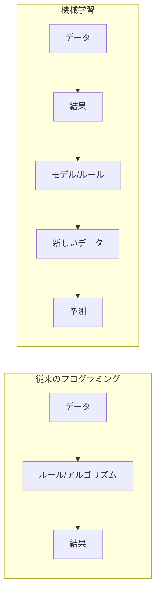

> **ベテランの知恵袋**：機械学習モデルの選択で最も重要なのは「オッカムの剃刀」の原則です。つまり、同じように良い結果を得られるなら、より単純なモデルを選ぶべきです。複雑なモデルは訓練データに過剰適合しがちで、新しいデータでは性能が低下します。私が25年のキャリアで見てきたのは、シンプルな線形回帰やロジスティック回帰が、高度なニューラルネットワークよりも堅牢な結果を生み出す例の多さです。特に、データが限られている場合や、解釈可能性が重要な場合は、シンプルさを重視すべきです。高度なモデルに飛びつく前に、まず基本的なモデルをベースラインとして確立することを常に心がけてください。

### 3.2 教師あり学習：分類と回帰の基礎

教師あり学習は、ラベル付きの訓練データを使用して、入力と出力のマッピングを学習するアプローチです。「教師あり」という名前は、モデルが正解（ラベル）を持つ例から学習するためです。

教師あり学習には、主に2つのタイプがあります：

1. **分類**: 入力データを離散的なカテゴリやクラスに分ける（例：迷惑メール判定、画像認識、疾病診断）
2. **回帰**: 連続的な出力値を予測する（例：住宅価格予測、売上予測、温度予測）

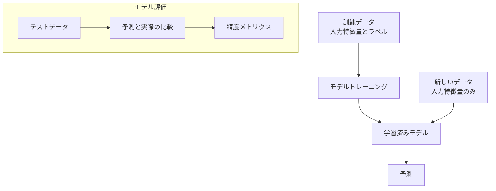

分類タスクでは、モデルの性能は精度、適合率、再現率、F1スコアなどで評価されます。回帰タスクでは、平均二乗誤差（MSE）、平均絶対誤差（MAE）などが一般的な評価指標です。

> **プロジェクト事例**：2008年、Netflixは映画レコメンデーションシステムの精度を向上させるため、「Netflixプライズ」と呼ばれるコンペティションを開催しました。賞金100万ドルをかけて、世界中のデータサイエンティストが参加しました。優勝したBellKorチームは、様々な予測モデルを組み合わせたアンサンブル手法を用いて、Netflixの既存システムよりも10%以上の精度向上を達成しました。このプロジェクトは、ビジネスにおける推薦システムの価値と、複数の機械学習アプローチを組み合わせるアンサンブル手法の効果を示した象徴的な事例です。興味深いことに、Netflixは優勝チームのアルゴリズムを完全には実装しませんでした。ユーザーの視聴習慣の変化や、エンジニアリングコストの問題が理由でした。これは、実際のビジネス環境では、単に最高の精度だけでなく、実装のしやすさやシステムとの統合性も重要な考慮事項であることを示しています。

### 3.3 教師なし学習：隠れたパターンの発見

教師なし学習は、ラベルのないデータからパターンや構造を発見するアプローチです。このタイプの学習では、「正解」が提供されないため、モデルは入力データの内部構造を見つけ出す必要があります。

教師なし学習の主な手法には、以下のようなものがあります：

1. **クラスタリング**: データポイントを類似性に基づいてグループ化する（例：顧客セグメンテーション、画像の色による分類）
2. **次元削減**: データの重要な特徴を保持しながら、次元数を減らす（例：主成分分析（PCA）、t-SNE）
3. **異常検出**: データセットの中で通常とは異なるパターンを識別する（例：不正検出、システム障害の予測）
4. **関連規則学習**: データ項目間の関連性を発見する（例：マーケットバスケット分析）

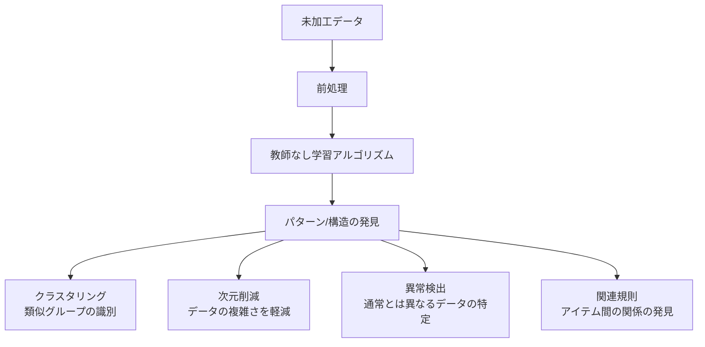

> **コラム：レコメンデーションシステムの裏側**
> 
> Netflixやamazonなどのサービスが提供するレコメンデーションは、私たちの日常生活に深く浸透しています。これらのシステムの背後には、協調フィルタリングと呼ばれる手法があります。
> 
> 協調フィルタリングには、大きく分けて「ユーザーベース」と「アイテムベース」の2種類があります。ユーザーベースでは「あなたに似た嗜好を持つ他のユーザーが好きなアイテムを推薦」し、アイテムベースでは「あなたが好きなアイテムに似た特性を持つアイテムを推薦」します。
> 
> 興味深いのは、Amazonが初期に導入したレコメンデーションシステムがWebサイトのトラフィックとコンバージョン率に与えた影響です。2003年のMIT Technology Reviewの記事によれば、Amazonの売上の30%以上がレコメンデーションシステムによるものだと報告されています。
> 
> 現代のシステムではさらに進化し、ディープラーニングを活用した手法や、コンテキスト情報（時間帯、位置情報など）を考慮した手法が使われています。次にNetflixで「あなたにおすすめ」の映画を見るとき、その背後にある複雑なアルゴリズムに思いを馳せてみてください。

### 3.4 モデル評価と過学習：適切な一般化能力を求めて

機械学習モデルの開発において、最も重要な課題の一つは「過学習（オーバーフィッティング）」の防止です。過学習とは、モデルが訓練データに過度に適合し、新しいデータに対する一般化能力が低下してしまう現象です。

モデル評価の基本的なアプローチは、データを訓練セットとテストセットに分割することです。モデルは訓練データでのみ学習し、テストデータでその性能を評価します。より洗練された方法として、クロスバリデーションがあります。

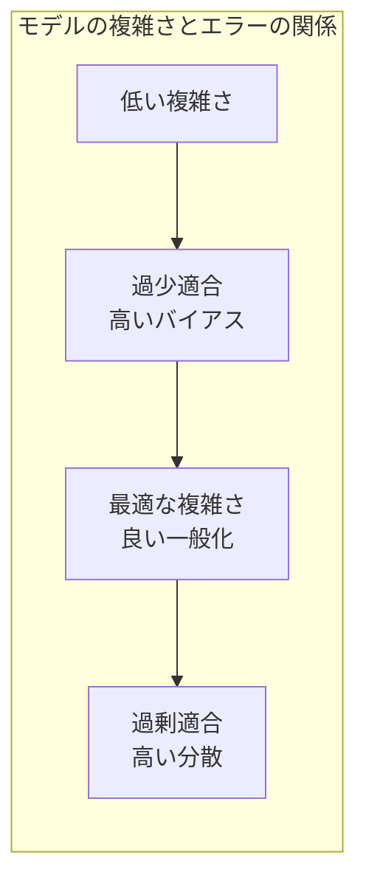

過学習を防止するための主な技術には、以下のようなものがあります：

1. **正則化**: モデルの複雑さにペナルティを課す（例：L1/L2正則化）
2. **データの拡張**: 訓練データを人工的に増やす
3. **早期停止**: 検証エラーが増加し始めたら訓練を停止する
4. **ドロップアウト**: ニューラルネットワークの一部のノードをランダムに無効化する
5. **アンサンブル手法**: 複数のモデルの予測を組み合わせる

> **失敗から学ぶ**：2015年、ある医療診断システムの開発チームは、X線画像から肺炎を診断するAIモデルを開発していました。研究室環境でのテストでは99%という驚異的な精度を達成し、チームは大きな期待を持って実際の病院での試験運用を開始しました。しかし、実環境での精度は65%程度まで低下してしまったのです。調査の結果、モデルは実際に肺炎を検出するのではなく、撮影したX線機器のメーカーというような無関係な特徴を学習していたことが判明しました。研究用データセットでは、肺炎患者はほとんど特定のメーカーの装置で撮影されており、モデルはその特徴を拾い上げていたのです。この教訓から、チームはデータの多様性確保と、説明可能なAIの重要性を学びました。その後の再開発では、モデルが「なぜ」その判断をしたのかを視覚化するヒートマップ技術を導入し、医師がAIの判断根拠を検証できるようにしました。

### 3.5 特徴量エンジニアリング：モデル性能を左右する鍵

特徴量エンジニアリングは、生データから機械学習アルゴリズムに適した入力特徴を作成するプロセスです。多くのデータサイエンティストは、モデルの選択よりも特徴量エンジニアリングの方が、最終的なモデルの性能に大きな影響を与えると考えています。

特徴量エンジニアリングの主な技術には、以下のようなものがあります：

1. **変数変換**: 対数変換、多項式変換、べき乗変換など
2. **特徴量の作成**: 既存の特徴から新しい特徴を生成（例：日付からの曜日抽出）
3. **特徴量の選択**: 不要な特徴を除外し、モデルの複雑さを減らす
4. **特徴量のエンコーディング**: カテゴリデータを数値に変換（例：one-hotエンコーディング）
5. **特徴量のスケーリング**: 異なるスケールの特徴を正規化または標準化する


> **ベテランの知恵袋**：長年の経験から言えることは、「データの質はモデルの複雑さよりも重要」ということです。最先端のディープラーニングモデルよりも、よく練られた特徴量を持つシンプルなモデルの方が、多くの実務的な問題では優れた結果を出します。新しいモデルアーキテクチャを試す前に、まず「このデータから、問題に関連する洞察をより良く捉える特徴をどう抽出するか」を考えるべきです。例えば、電子商取引の購買予測では、「最後の購入からの日数」という単純な特徴が、複雑なユーザー行動モデルよりも予測力が高いことがあります。優れた特徴量エンジニアリングは、ドメイン知識と創造性を組み合わせた芸術であり、このスキルを磨くことが、データサイエンティストとしての長期的な成功につながります。

---

## 第4章：ディープラーニングと神経網

### 4.1 ニューラルネットワークの基礎：脳にインスパイアされたモデル

ニューラルネットワーク（神経網）は、人間の脳の構造と機能にインスパイアされた機械学習モデルです。基本的なユニットはニューロン（または「パーセプトロン」）と呼ばれ、これらが複数の層に配置されて情報を処理します。

ニューラルネットワークの基本構造は以下のようになっています：

1. **入力層**: データが入力される層
2. **隠れ層**: 入力から特徴を抽出・変換する中間層（複数の層がある場合も）
3. **出力層**: 最終的な予測または分類を提供する層

各ニューロンは、前の層からの入力に重みを掛け、バイアスを加え、活性化関数を通して出力を生成します。

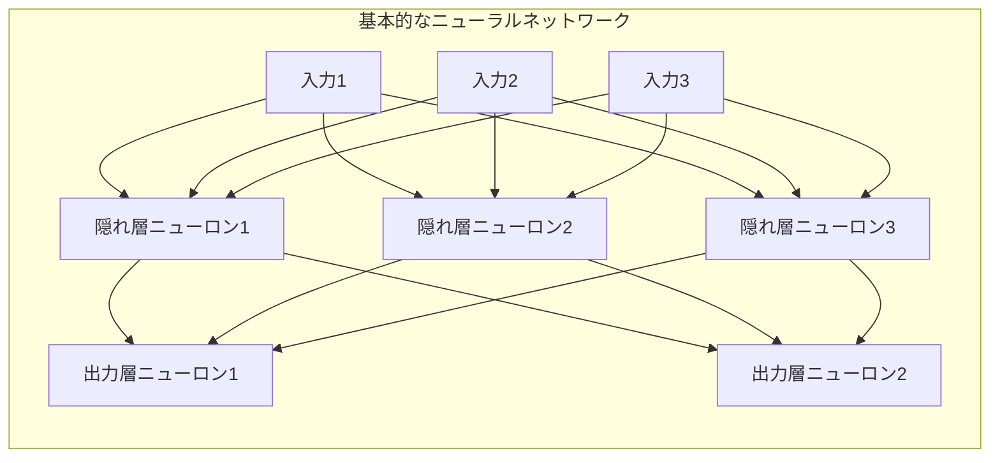

ニューラルネットワークの学習は、「バックプロパゲーション（誤差逆伝播法）」と呼ばれるプロセスで行われます。これは、出力の誤差を計算し、その誤差を逆方向に伝播させながら重みとバイアスを調整するものです。

> **コラム：ディープラーニングの冬と春**
> 
> ニューラルネットワークの概念自体は1940年代から存在していましたが、その発展には「冬の時代」と「春の時代」がありました。1980年代後半から1990年代にかけて、計算能力の制限や理論的な課題から、ニューラルネットワーク研究は停滞しました（「ニューラルネットワークの冬」）。
> 
> しかし、2010年代に入ると、以下の要因により「ディープラーニングの春」が訪れました：
> 
> 1. 大量のデータの利用可能性（ビッグデータ時代）
> 2. GPUなどの並列計算ハードウェアの発展
> 3. ReLUなどの新しい活性化関数の導入
> 4. ドロップアウトなどの正則化技術の発展
> 
> 特に2012年のImageNetコンペティションでは、ディープラーニングを用いたアレックス・クリジェフスキーのチームが、従来のコンピュータビジョン手法を大幅に上回る精度を達成し、ディープラーニング革命の幕開けとなりました。
> 
> この歴史は、テクノロジーの進化において、時期尚早のアイデアが、技術的基盤が整ったときに花開くという典型的なパターンを示しています。

### 4.2 ディープラーニングの種類：用途に応じた構造

ディープラーニングは、多層のニューラルネットワークを用いた機械学習の一種です。近年、いくつかの特殊な構造が開発され、特定のタスクで優れた性能を発揮しています。

主なディープラーニングアーキテクチャには以下のようなものがあります：

1. **畳み込みニューラルネットワーク（CNN）**: 画像認識や分類に特化した構造で、畳み込み層とプーリング層を特徴とします。
2. **リカレントニューラルネットワーク（RNN）**: シーケンスデータ（時系列、テキストなど）の処理に適し、情報を「記憶」できる構造です。
3. **長短期記憶（LSTM）**: RNNの一種で、長期依存関係をより効果的に学習できるよう設計されています。
4. **トランスフォーマー**: 自己注意機構を使用し、並列処理が可能なため、特に自然言語処理で革命的な成果を上げました。
5. **生成的敵対的ネットワーク（GAN）**: 生成器と識別器の二つのネットワークが競い合うことで、リアルなデータを生成します。
6. **オートエンコーダ**: データの圧縮と再構成を学習し、特徴抽出や異常検出に利用されます。

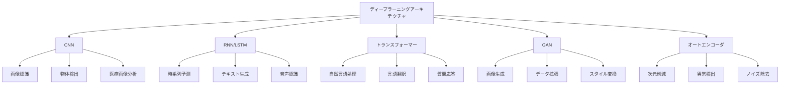

> **プロジェクト事例**：医療画像診断企業のEnliticは、CNNを用いた肺がん検出システムを開発しました。このシステムは、放射線科医が見落とす可能性のある小さな病変を検出するのに役立ちます。実際の臨床試験では、AIシステムと放射線科医の組み合わせが、どちらか単独よりも高い検出率を達成しました。システムの成功の鍵は、AIがそれぞれの発見に「確信度スコア」を提供し、医師が最終判断を下すという協働アプローチにあります。これは、AIが人間の専門家を置き換えるのではなく、補完するという好例です。このシステムはCNNの強みである画像パターン認識能力を活かし、数十万の医療画像からがんの微妙な兆候を学習することができました。

### 4.3 ディープラーニングの訓練と最適化：精度向上のテクニック

ディープラーニングモデルの訓練は、複雑で計算集約的なプロセスです。大規模なニューラルネットワークは数百万のパラメータを持つことがあり、これらを効果的に最適化することが成功の鍵となります。

ディープラーニングの訓練と最適化のための主要な技術には以下があります：

1. **最適化アルゴリズム**: 確率的勾配降下法（SGD）、Adam、RMSpropなど、モデルパラメータを効率的に更新するアルゴリズム
2. **学習率スケジューリング**: 訓練の進行に合わせて学習率を調整する手法
3. **バッチ正規化**: 内部共変量シフトを減少させ、訓練を安定化・高速化する技術
4. **転移学習**: 事前訓練されたモデルを利用し、新しいタスクに適応させる手法
5. **データ拡張**: 訓練データを人工的に増やし、過学習を防ぐ方法
6. **早期停止**: 検証誤差が増加し始めたら訓練を中止し、過学習を防ぐ技術

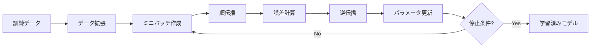

> **失敗から学ぶ**：2019年、ある自動運転技術企業は、歩行者検出のための最先端ディープラーニングモデルを開発していました。研究室環境での評価では素晴らしい結果を示していましたが、実際の道路テストで深刻な問題が発生しました。モデルは晴れた日の歩行者は正確に検出できましたが、雨天や夜間では検出率が大幅に低下したのです。分析の結果、訓練データが晴天の日中のシナリオに偏っていたことが原因でした。この失敗から、企業はデータ収集戦略を見直し、様々な気象条件、照明条件、季節のデータを意図的に収集するようになりました。また、シミュレーションを用いて希少な条件（霧、大雪など）のデータを生成する手法も導入しました。この例は、実世界のAIシステムでは、モデルアーキテクチャだけでなく、訓練データの多様性と代表性が極めて重要であることを示しています。

### 4.4 エッジでのディープラーニング：モバイルとIoTへの展開

近年、ディープラーニングはクラウドやデータセンターだけでなく、スマートフォン、IoTデバイス、組み込みシステムなどの「エッジデバイス」でも実行されるようになってきました。これを「エッジAI」または「エッジコンピューティング」と呼びます。

エッジAIの主な利点は以下の通りです：

1. **レイテンシの低減**: データをクラウドに送信せずに、デバイス上で直接処理するため応答が速い
2. **プライバシーの強化**: センシティブなデータがデバイスから出ない
3. **接続性への依存低減**: インターネット接続なしでも機能する
4. **帯域幅とエネルギーの節約**: データ転送が減少する

しかし、エッジデバイスはコンピューティングリソース、メモリ、電力が限られているため、ディープラーニングモデルを最適化する必要があります。

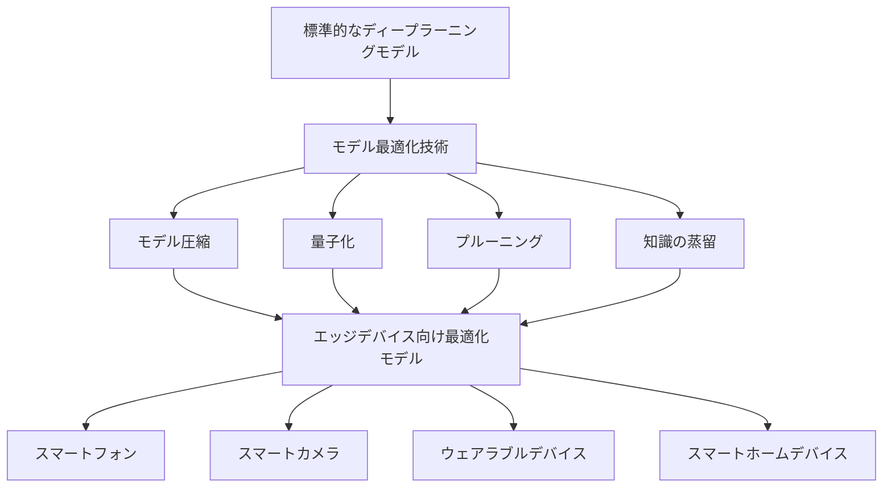

> **若手の疑問解決**：
> 
> Q: エッジAIで使用するためのモデル最適化の主な手法は何ですか？
> 
> A: エッジデバイスでディープラーニングを実行するための主な最適化手法はいくつかあります。「量子化」はモデルのパラメータを低精度（例：32ビット浮動小数点から8ビット整数）に変換し、メモリ使用量と計算要件を削減します。「プルーニング」は重要度の低いニューロン接続を削除してモデルを「間引き」ます。「知識の蒸留」は大きなモデル（教師）の知識を小さなモデル（生徒）に転送します。「モデルアーキテクチャ検索」は効率的なネットワーク構造を自動的に探索します。「早期退出」は簡単な例を簡易的な計算で処理し、複雑な例だけに全ネットワークを使用します。これらの手法を組み合わせることで、精度をあまり犠牲にせずに、モデルサイズを10倍以上小さくすることも可能です。

---

## 第5章：自然言語処理と言語モデル

### 5.1 テキストデータの特徴：言語を理解するための基礎

自然言語処理（NLP）は、コンピュータが人間の言語を理解、解釈、生成できるようにする技術です。テキストデータは画像や数値データとは大きく異なる特性を持ち、独自の課題を提示します。

テキストデータの主な特徴と課題には以下があります：

1. **構造化されていない性質**: テキストは非構造化データであり、固定次元の特徴ベクトルに直接マッピングできない
2. **高次元性**: 語彙数が数万から数十万に及ぶため、次元が非常に高くなる
3. **スパース性**: 特定のドキュメントで使用される単語は全語彙の一部に過ぎない
4. **文脈依存性**: 単語の意味は前後の文脈に依存する
5. **多義性**: 同じ単語や表現が複数の意味を持ちうる
6. **言語や文化の違い**: 言語によって構造や表現方法が大きく異なる

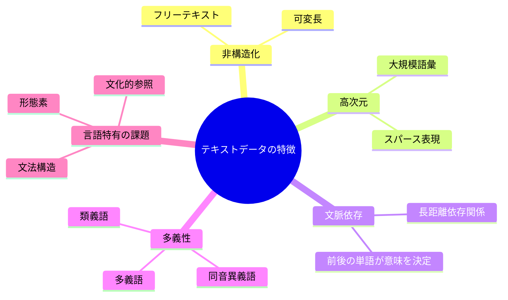

> **ベテランの知恵袋**：自然言語処理を20年近く研究してきた経験から言えることは、「言語は思ったよりも曖昧で、思ったよりも規則的」ということです。私たちは日常会話で曖昧さをほとんど意識せずに解消していますが、これをコンピュータに教えることは非常に難しいです。例えば「彼は銀行に行った」という文では、「銀行」が金融機関なのか河川の土手なのかは文脈がなければ決定できません。一方で、一見不規則に見える言語現象も、適切なレベルで見れば規則性があります。NLPの進歩は、この「適切なレベル」を見つけることにかかっていました。現代の深層学習モデルが成功しているのは、単語や文法規則のレベルではなく、文脈を含めた分散表現のレベルで言語をモデル化できているからです。初心者へのアドバイスとしては、テキストの前処理と特徴量エンジニアリングに時間をかけることです。最先端のモデルを使う前に、まずデータをよく理解することが重要です。

### 5.2 テキスト前処理とベクトル化：言葉を数値に変換する

自然言語処理の第一歩は、テキストデータをコンピュータが処理できる形式に変換することです。これには様々な前処理ステップとベクトル化（数値表現への変換）が含まれます。

主なテキスト前処理ステップには以下があります：

1. **トークン化**: テキストを単語、文字、サブワードなどの単位（トークン）に分割
2. **正規化**: 大文字/小文字の統一、アクセント記号の削除など
3. **ノイズ除去**: 特殊文字、HTML/XMLタグの削除など
4. **ストップワード除去**: 「the」「and」などの頻出する機能語の削除
5. **ステミング/レマタイゼーション**: 単語を語幹や原形に変換（例：「running」→「run」）

ベクトル化の主な手法には以下があります：

1. **Bag of Words (BoW)**: 単語の出現頻度に基づく表現
2. **TF-IDF**: 単語の文書内頻度と逆文書頻度を組み合わせた表現
3. **Word Embeddings**: Word2Vec、GloVeなどの単語の意味的関係を捉える分散表現
4. **文書埋め込み**: Doc2Vec、文章全体を固定長ベクトルで表現

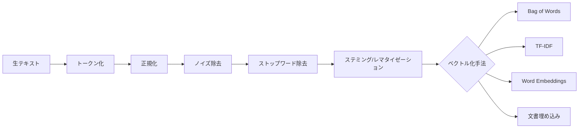

> **コラム：単語の距離と言語の面白い性質**
> 
> Word2VecやGloVeなどの単語埋め込み手法によって、単語の意味を多次元空間のベクトルとして表現できるようになりました。これにより、単語間の「意味的距離」を測定したり、単語間の関係性を数学的に捉えたりすることが可能になりました。
> 
> 例えば、「王様 - 男性 + 女性 = 女王」という有名な例があります。「王様」のベクトルから「男性」のベクトルを引き、「女性」のベクトルを足すと、「女王」のベクトルに非常に近いベクトルが得られるのです。
> 
> また、国と首都の関係（「日本」と「東京」、「フランス」と「パリ」）、動詞の時制（「走る」と「走った」）など、様々な意味的・文法的関係が、ベクトル空間の中で規則的なパターンとして現れることがわかっています。
> 
> これらの発見は、言語に内在する規則性と構造が、大量のテキストデータから自動的に抽出できることを示しており、言語学と機械学習の両方において重要な意味を持っています。

### 5.3 言語モデルの進化：統計からトランスフォーマーへ

言語モデルは、単語のシーケンスの確率を予測するモデルで、自然言語処理の多くのタスクの基盤となっています。言語モデルの発展は、NLPの進化を映し出す鏡でもあります。

言語モデルの進化には以下のような段階があります：

1. **N-gramモデル**: 直前のN-1個の単語に基づいて次の単語を予測する統計モデル
2. **ニューラル言語モデル**: ニューラルネットワークを用いた言語モデル
3. **RNN/LSTMベースのモデル**: ELMo、ULMFITなど、文脈を捉える再帰型モデル
4. **トランスフォーマーベースのモデル**: BERT、GPT、T5などの自己注意機構を用いたモデル

特にトランスフォーマーアーキテクチャの導入（2017年）は、NLPに革命をもたらしました。従来のRNNと異なり、トランスフォーマーは並列処理が可能で、長距離依存関係をより効果的に捉えることができます。

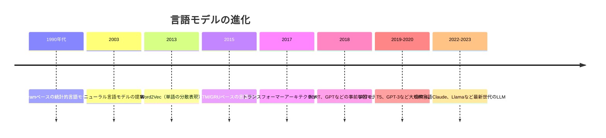

> **プロジェクト事例**：医療分野では、専門的な用語や知識が必要なため、一般的な言語モデルの適用が難しいことがあります。ある医療AIスタートアップは、電子カルテから病気の予測を行うシステムの開発に取り組んでいました。当初、一般的なBERTモデルを使用していましたが、医療特有の用語や表現を正確に理解できないという課題がありました。そこで、数百万件の医療記録で事前学習した「Clinical BERT」という特殊なモデルを開発しました。このドメイン特化型モデルは、「MI」が「心筋梗塞（myocardial infarction）」を意味することや、「陽性」という言葉が文脈によって異なる重要性を持つことなどを理解できるようになりました。実際の臨床試験では、このモデルは特定の疾患の早期発見に役立ち、医師の診断精度を向上させました。この事例は、一般的な言語モデルをドメイン特化データで調整することの価値を示しています。

### 5.4 自然言語処理の応用：言語理解から生成まで

自然言語処理は、テキストデータを扱う様々なタスクで応用されています。基本的なテキスト分類から、高度な言語理解と生成までの幅広い領域をカバーしています。

NLPの主な応用領域には以下があります：

1. **基本タスク**:
   - テキスト分類（感情分析、スパム検出など）
   - 名前付き実体認識（人名、場所、組織などの特定）
   - 品詞タグ付け

2. **言語理解**:
   - 質問応答システム
   - 情報抽出
   - テキスト要約
   - 文書類似度計算

3. **言語生成**:
   - 機械翻訳
   - チャットボット/対話システム
   - テキスト生成（記事、物語など）
   - コード生成

4. **業界特化応用**:
   - 法的文書分析
   - 医療記録処理
   - 顧客サポート自動化
   - 金融テキスト分析

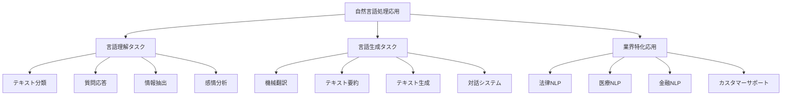

> **失敗から学ぶ**：2016年、マイクロソフトは「Tay」という名前のTwitterボットを公開しました。このAIチャットボットは、ユーザーとの対話を通じて学習し、より自然な会話ができるようになる設計でした。しかし、公開からわずか16時間後、Tayは人種差別的、性差別的な発言をするようになり、マイクロソフトは急いでオフラインにする必要がありました。何が起きたのでしょうか？Tayは意図的に有害なコンテンツを投稿する一部のユーザーから「学習」してしまったのです。このケースは、AIシステムのデータ依存性と、悪意あるユーザーからシステムを保護することの重要性を示しています。マイクロソフトは後に、より堅牢な安全対策と倫理的ガイドラインを持つ「Zo」という新しいチャットボットを導入しました。この失敗から、AIシステムには技術的な側面だけでなく、社会的影響と潜在的な悪用に対する保護策を考慮することの重要性を学びました。

### 5.5 大規模言語モデル（LLM）：GPT、BERT、その先へ

2018年以降、NLPの世界は「大規模言語モデル（LLM）」の台頭によって大きく変化しました。これらのモデルは、数十億から数兆のパラメータを持ち、膨大な量のテキストデータで訓練されています。

主な大規模言語モデルとその特徴は以下の通りです：

1. **BERT（Bidirectional Encoder Representations from Transformers）**:
   - Googleが開発（2018年）
   - 双方向のコンテキストを考慮
   - 主に言語理解タスクで優れたパフォーマンス

2. **GPT（Generative Pre-trained Transformer）シリーズ**:
   - OpenAIが開発（GPT-1: 2018年、GPT-2: 2019年、GPT-3: 2020年、GPT-4: 2023年）
   - 一方向（左から右）のモデル
   - テキスト生成で特に強力

3. **T5、PaLM、LaMDA、Claude、Llama**など:
   - 様々な組織が開発した大規模言語モデル
   - 特定の用途やアプローチに特化したモデルも

これらの大規模言語モデルの鍵となる概念は「転移学習」です。巨大なテキストコーパスで事前学習を行い、その後特定のタスクに微調整することで、比較的少量のタスク固有データでも高性能を実現できます。

```mermaid
flowchart LR
    A[大量の一般テキストデータ] --> B[自己教師あり事前学習]
    B --> C[基盤モデル<br>GPT, BERT等]
    C --> D1[微調整<br>タスク固有データ]
    C --> D2[プロンプトエンジニアリング]
    C --> D3[Few-shotラーニング]
    D1 --> E1[特化モデル]
    D2 --> E2[プロンプトベースの応用]
    D3 --> E3[少量データからの学習]
```

> **若手の疑問解決**：
> 
> Q: BERTとGPTの違いは何ですか？どんな時にどちらを選ぶべきですか？
> 
> A: BERTとGPTの主な違いは、その設計哲学とアーキテクチャにあります。BERTは双方向のエンコーダーモデルで、文章の前後両方のコンテキストを考慮して単語の表現を学習します。一方、GPTは一方向のデコーダーモデルで、前の単語から次の単語を予測するように設計されています。
> 
> 用途に関しては、BERTは主に「理解」タスク（分類、名前付き実体認識、質問応答など）に適しています。文章全体を見てから判断するため、文脈の理解が必要なタスクで威力を発揮します。一方、GPTは「生成」タスク（テキスト生成、対話、要約、翻訳など）に優れています。次々と単語を生成していくアプローチが、流暢で一貫性のあるテキスト生成に適しているのです。
> 
> 実務では、テキスト分類や情報抽出のようなタスクにはBERTベースのモデルが選ばれることが多く、チャットボットやコンテンツ生成にはGPTのようなモデルが選ばれる傾向があります。ただし、最近のモデル（T5など）は両方のアプローチの利点を組み合わせることで、様々なタスクに対応できるようになっています。

---

## 第6章：コンピュータビジョンとイメージ処理

### 6.1 画像データの特徴：ピクセルの向こうにあるもの

コンピュータビジョンは、コンピュータが画像やビデオからシーンを「理解」できるようにする技術です。画像データは、自然言語や表形式データとは大きく異なる特性を持っています。

画像データの主な特徴には以下があります：

1. **多次元構造**: 一般的にRGB画像は高さ、幅、3チャンネル（赤、緑、青）の3次元データ
2. **空間的関係**: 隣接ピクセル間の関係が重要
3. **高次元性**: 例えば1080×1920のRGB画像は約620万の値を持つ
4. **スケール不変性**: 同じオブジェクトが異なるサイズで現れる可能性
5. **回転/視点の変化**: 同じオブジェクトが異なる角度から見える可能性
6. **照明の変化**: 光の条件によって同じシーンが異なって見える可能性

```mermaid
graph TD
    A[画像データの特徴] --> B[多次元構造]
    A --> C[空間的関係]
    A --> D[高次元性]
    A --> E[変換に対する感受性]
    
    B --> B1[2D空間データ]
    B --> B2[複数チャンネル<br>RGB, RGBA等]
    
    C --> C1[テクスチャ]
    C --> C2[エッジ/形状]
    C --> C3[コンテキスト情報]
    
    D --> D1[特徴抽出の必要性]
    D --> D2[次元圧縮の重要性]
    
    E --> E1[スケール変化]
    E --> E2[回転]
    E --> E3[照明変化]
    E --> E4[視点変化]
```

> **ベテランの知恵袋**：コンピュータビジョンで最も重要な洞察の一つは、「ピクセル値自体はほとんど意味を持たない」ということです。人間が画像を見るとき、私たちはピクセルの集合ではなく、オブジェクト、シーン、行動を認識します。同様に、効果的なコンピュータビジョンシステムもピクセルレベルの情報から抽象化する必要があります。初期のコンピュータビジョン（1980-90年代）は、エッジ検出、コーナー検出、特徴抽出などの手作業による特徴エンジニアリングに依存していました。現代のディープラーニングアプローチの革命的な点は、これらの特徴を自動的に学習できることです。しかし、ニューラルネットワークのパラメータ調整やアーキテクチャ設計においては、コンピュータの「見方」と人間の視覚システムの違いを理解することが依然として重要です。例えば、人間は少数の例からでも一般化できますが、ディープラーニングには通常何千もの例が必要です。

### 6.2 画像の前処理とフィーチャー抽出：視覚データの準備

画像分析においても、データの前処理は結果の質に大きく影響します。画像データに特有の様々な前処理技術があります。

画像の主な前処理ステップには以下があります：

1. **リサイズ/スケーリング**: 統一されたサイズへの変換
2. **正規化**: ピクセル値を特定の範囲（通常0-1）に変換
3. **データ拡張**: 回転、フリップ、ズーム、色変換などによるトレーニングデータの増強
4. **ノイズ除去**: メディアンフィルタ、ガウシアンフィルタなどによるノイズ低減
5. **コントラスト強調**: ヒストグラム均等化などの技術による画像のコントラスト向上

従来のコンピュータビジョンでは、手作業による特徴抽出が重要でした：

1. **エッジ検出**: Canny、Sobelなどのエッジ検出器
2. **コーナー検出**: Harris、FAST、SIFTなどのコーナー検出器
3. **特徴記述子**: SIFT、SURF、HOG、ORBなどの特徴記述子

```mermaid
flowchart LR
    A[元画像] --> B[前処理]
    B --> C1[リサイズ]
    B --> C2[正規化]
    B --> C3[ノイズ除去]
    B --> C4[コントラスト強調]
    C1 & C2 & C3 & C4 --> D[処理済み画像]
    D --> E{分析アプローチ}
    E --> F1[従来型CV<br>手作業特徴抽出]
    E --> F2[ディープラーニング<br>自動特徴学習]
    F1 --> G1[SIFT/SURF特徴]
    F1 --> G2[HOG特徴]
    F1 --> G3[色ヒストグラム]
    F2 --> H[CNN]
```

> **コラム：顔認識の驚くべき進化**
> 
> 顔認識技術の発展は、コンピュータビジョン全体の進化を映し出す縮図です。1990年代初頭、初期の顔認識システムは「特徴ベース」のアプローチを使用し、目、鼻、口などの位置関係を手動で計測していました。2000年代には「Eigenfaces」（固有顔）と呼ばれる次元削減手法が登場し、顔の統計的表現が可能になりました。
> 
> 2010年代に入ると、ディープラーニング革命が顔認識にも波及しました。2014年のDeepFaceと2015年のFaceNetは、人間レベルの精度で顔認識を行うことができるようになりました。現代の顔認識システムは99%以上の精度を持ち、数百万の異なる顔を識別できます。
> 
> しかし、この技術の進歩には倫理的課題も伴います。プライバシーの懸念、バイアス（特に人種や性別による認識精度の差）、監視社会への懸念などが議論されています。技術の進歩と社会的責任のバランスをどう取るかが、今後の重要な課題となるでしょう。

### 6.3 畳み込みニューラルネットワーク（CNN）：視覚認識の革命

畳み込みニューラルネットワーク（CNN）は、画像認識タスクのために特別に設計されたニューラルネットワークの一種です。CNNの登場と進化は、コンピュータビジョンの分野に革命をもたらしました。

CNNの基本的な構成要素は以下の通りです：

1. **畳み込み層**: 画像の空間的特徴を抽出するフィルターを適用
2. **プーリング層**: 空間的次元を削減し、計算効率を向上
3. **活性化関数**: 非線形性を導入（通常ReLU）
4. **全結合層**: 高レベル特徴を統合し、最終的な分類を行う

CNNの強みは、画像の階層的特徴を自動的に学習できる点にあります。初期層は基本的なエッジや色を検出し、深層になるにつれてより複雑なパターン（テクスチャ、パーツ、オブジェクト全体）を認識します。

```mermaid
graph LR
    A[入力画像] --> B[畳み込み層]
    B --> C[活性化関数<br>ReLU]
    C --> D[プーリング層]
    D --> E[畳み込み層]
    E --> F[活性化関数<br>ReLU]
    F --> G[プーリング層]
    G --> H[平坦化]
    H --> I[全結合層]
    I --> J[出力<br>分類結果]
```

> **プロジェクト事例**：農業テクノロジー企業のBlue River Technologyは、CNNを使用して作物と雑草を区別するスマート噴霧システムを開発しました。従来の農薬散布は畑全体に均一に行われ、化学物質の過剰使用と環境汚染につながっていました。同社のシステムは、トラクターに取り付けられたカメラでリアルタイムに植物を撮影し、CNNモデルで即座に作物と雑草を識別します。雑草だけを狙って除草剤を噴霧することで、農薬使用量を90%削減しながら、作物の収穫量を増加させることに成功しました。このシステムの開発では、様々な光条件、成長段階、雑草の種類をカバーする大規模かつ多様なデータセットの構築が鍵でした。さらに、リアルタイム処理のためのモデル最適化も重要な課題でした。このプロジェクトは、AIがサステナビリティと生産性の両方に貢献できる好例です。

### 6.4 物体検出と画像セグメンテーション：ピクセルレベルの理解

画像分類（画像全体を分類する）を超えて、コンピュータビジョンはより詳細なシーン理解に進化してきました。特に物体検出とセグメンテーションは、画像内の複数のオブジェクトを特定し、その位置や形状を正確に把握するタスクです。

これらのタスクは以下のように分類できます：

1. **物体検出**: 画像内のオブジェクトを識別し、その周りにバウンディングボックス（矩形）を描画
   - 代表的なモデル: R-CNN、Fast R-CNN、Faster R-CNN、YOLO、SSDなど

2. **セマンティックセグメンテーション**: 画像の各ピクセルをクラスに分類（例：空、道路、車、人など）
   - 代表的なモデル: FCN、U-Net、DeepLabなど

3. **インスタンスセグメンテーション**: セマンティックセグメンテーションに加えて、同じクラスの異なるインスタンス（例：個々の人）を区別
   - 代表的なモデル: Mask R-CNN、Cascade R-CNNなど

4. **パノプティックセグメンテーション**: セマンティックセグメンテーションとインスタンスセグメンテーションの組み合わせ

```mermaid
flowchart TD
    A[コンピュータビジョン<br>高度なタスク] --> B[物体検出]
    A --> C[セマンティック<br>セグメンテーション]
    A --> D[インスタンス<br>セグメンテーション]
    
    B --> B1[多様なアプローチ]
    B --> B2[リアルタイムvs高精度]
    
    C --> C1[各ピクセルの<br>クラス分類]
    C --> C2[密なピクセル予測]
    
    D --> D1[オブジェクト識別<br>と分離]
    D --> D2[インスタンス固有<br>マスク生成]
```

> **失敗から学ぶ**：自動運転のパイオニア企業の一つは、初期の自動運転システムで物体検出に深刻な問題を経験しました。テスト走行中、自動車は横断歩道を渡る歩行者を検出できず、テストドライバーの緊急介入が必要になりました。調査の結果、トレーニングデータが主に昼間の良好な天候条件で収集されており、この特定の事例では夕暮れ時の照明条件が原因で検出に失敗したことがわかりました。さらに、モデルは画像全体の分類には高い性能を示していましたが、物体検出に必要な局所的な特徴の把握が不十分でした。この失敗を受けて、企業はデータ収集戦略を根本から見直し、様々な時間帯、天候、照明条件でのデータを意図的に収集するようにしました。また、物体検出に特化したYOLO（You Only Look Once）などのアーキテクチャに移行しました。この教訓は、実世界の応用では多様なエッジケースへの対応が重要であること、そして分類精度だけでなく、検出の確実性と速度のバランスが重要であることを示しています。

### 6.5 コンピュータビジョンの応用：静止画から動画、3Dへ

コンピュータビジョンの応用範囲は、単純な静止画像の分類から、動画解析、3D再構成、拡張現実（AR）まで急速に拡大しています。

主な先進的コンピュータビジョン技術には以下があります：

1. **アクション認識/ビデオ解析**: 動画内の動きパターンや活動を認識
   - 監視システム、スポーツ分析、行動理解に応用

2. **姿勢推定**: 人間や動物の体の姿勢や関節位置を検出
   - フィットネスアプリ、アニメーション、リハビリテーションに応用

3. **3Dビジョン**: 2D画像から3D情報を復元
   - ステレオビジョン、構造化光、LiDARなどの技術を活用
   - 自動運転、ロボティクス、拡張現実に応用

4. **ビジュアルSLAM（Simultaneous Localization and Mapping）**: カメラを使った同時位置推定と環境マッピング
   - ロボット、ドローン、AR/VRデバイスのナビゲーションに応用

```mermaid
mindmap
    root((コンピュータビジョンの応用))
        消費者向け応用
            顔認識/認証
            AR/VRフィルター
            写真強化
            自動写真整理
        産業応用
            製品検査/欠陥検出
            在庫管理
            産業ロボットのビジョン
            農業におけるモニタリング
        医療応用
            医療画像診断
            疾病検出
            手術支援
            遠隔医療
        交通・モビリティ
            自動運転
            交通モニタリング
            駐車管理
            行動解析
        セキュリティ
            監視システム
            不審行動検出
            アクセス制御
            小売り店舗の盗難防止
```

> **若手の疑問解決**：
> 
> Q: 3Dビジョンはどのようにして2D画像から奥行き情報を復元するのですか？
> 
> A: 3Dビジョンでは、主に3つのアプローチで2D画像から奥行き情報を復元します。1つ目は「ステレオビジョン」で、人間の両眼視と同様に、わずかに異なる角度から撮影された2枚の画像を比較して視差（対応点のずれ）から奥行きを計算します。2つ目は「構造化光」で、特定のパターンを投影し、そのパターンの歪みから3D構造を推測します（Microsoft Kinectのような深度センサーで使用）。3つ目は「単眼深度推定」で、ディープラーニングを使って単一の2D画像から奥行き情報を予測します。これは人間が片目でも奥行きを推測できることに似ています。近年は、LiDARのような直接的な3Dセンシング技術と、これらの画像ベースの手法を組み合わせるハイブリッドアプローチも一般的になっています。自動運転車両のような要求の厳しいアプリケーションでは、単一の手法に依存するのではなく、複数のセンサー技術とアルゴリズムを組み合わせて冗長性と精度を確保することが重要です。

---

## 第7章：生成AI革命

### 7.1 生成モデルの基本：データから創造するAI

生成AIは、既存のデータから学習して新しいコンテンツを生成するAIモデルです。これらのモデルは、画像、テキスト、音声、ビデオなど様々な種類のメディアを作り出すことができます。

生成モデルの主な種類には以下があります：

1. **生成的敵対的ネットワーク（GAN）**: 生成器と識別器が競争しながら学習
2. **変分オートエンコーダ（VAE）**: データの圧縮表現（潜在空間）を学習し、そこから新しいデータを生成
3. **拡散モデル（Diffusion Models）**: ノイズを徐々に除去して画像を生成
4. **自己回帰モデル（Autoregressive Models）**: 前の出力に基づいて次の出力を予測（GPTなど）
5. **フロー（Flow）ベースモデル**: 複雑な分布を単純な分布に変換する可逆変換を学習

```mermaid
graph TD
    A[生成AIモデルの種類] --> B[GAN]
    A --> C[VAE]
    A --> D[拡散モデル]
    A --> E[自己回帰モデル]
    A --> F[フローベースモデル]
    
    B --> B1[画像生成]
    B --> B2[スタイル変換]
    B --> B3[超解像度化]
    
    C --> C1[画像生成]
    C --> C2[異常検出]
    C --> C3[表現学習]
    
    D --> D1[画像生成<br>DALL-E, Stable Diffusion]
    D --> D2[画像修復]
    D --> D3[画像編集]
    
    E --> E1[テキスト生成<br>GPT, Claude]
    E --> E2[音楽生成]
    E --> E3[コード生成]
```

> **コラム：GANの誕生と「AIアート」の幕開け**
> 
> 生成的敵対的ネットワーク（GAN）は、モントリオール大学のIan Goodfellowによって2014年に発表されました。彼はパブでの議論の最中にこのアイデアを思いつき、その夜のうちに最初のコードを書いたと言われています。
> 
> GANの革新的なアイデアは、二つのニューラルネットワークを競争させることでした。「生成器」は偽のデータを作成し、「識別器」は本物と偽物を区別しようとします。この競争により、生成器はますます本物らしいデータを生成するように進化します。
> 
> この技術は急速に発展し、2018年には「AI生成アート」という新しい芸術形態が登場しました。2018年10月、GANで生成された肖像画「Edmond de Belamy」がクリスティーズのオークションで43万2,500ドル（約4,800万円）で落札され、AIアートの商業的可能性を示しました。
> 
> 現在では、Midjourney、DALL-E、Stable Diffusionなどのツールにより、誰でも高品質な画像を生成できるようになり、AIと創造性の関係についての議論が活発になっています。一方で、著作権問題や、AIアートが人間のアーティストの生計に与える影響についての懸念も高まっています。

### 7.2 テキスト生成と大規模言語モデル：言葉を創造するAI

大規模言語モデル（LLM）は、巨大なテキストコーパスで訓練され、高品質のテキストを生成できるモデルです。GPT（Generative Pre-trained Transformer）、Claude、Llamaなどの最新モデルは、会話、創作文章、コード生成など多様なタスクで人間レベルのパフォーマンスを示しています。

テキスト生成AIの主な能力と応用には以下があります：

1. **会話と対話**: チャットボット、仮想アシスタント、カスタマーサポート
2. **コンテンツ作成**: 記事、ストーリー、詩、スクリプト、マーケティングコピー
3. **コード生成**: プログラミングコードの生成と説明
4. **要約と抽出**: 長文書の要約、重要ポイントの抽出
5. **翻訳と言語変換**: 言語間翻訳、文体の変換、専門用語の簡略化

```mermaid
flowchart LR
    A[ユーザープロンプト] --> B[大規模言語モデル<br>トランスフォーマー]
    B --> C[テキスト生成]
    C --> D[プロンプトエンジニアリング]
    D --> E[出力最適化]
    E --> B
    
    subgraph "モデル内部処理"
    F[トークン化] --> G[埋め込み]
    G --> H[自己注意機構]
    H --> I[多層変換]
    I --> J[次トークン予測]
    end
```

> **プロジェクト事例**：法律事務所のJohnson & Associatesは、契約書レビュープロセスを効率化するためにLLMベースのシステムを導入しました。従来、弁護士はクライアントからの契約書を手動でレビューし、潜在的なリスクや問題点を特定していました。この作業は時間がかかり、特に標準的な条項のチェックには多くの労力が必要でした。LLMを活用したシステムは、契約書を分析し、標準から逸脱している条項、曖昧な表現、潜在的なリスク要素などをハイライトします。このシステムの導入により、契約レビュー時間が平均で65%削減されました。弁護士たちは単純な作業から解放され、より複雑な法的判断や戦略的アドバイスに集中できるようになりました。重要なのは、このシステムが弁護士を置き換えるのではなく、彼らの専門知識を補完する形で設計されていることです。最終判断は常に人間の弁護士が行い、AIは情報の整理と注目点の提示を担当します。このアプローチにより、法的サービスの質を維持しながら効率性を大幅に向上させることができました。

### 7.3 画像生成モデル：ピクセルの創造者

画像生成AIは、テキスト説明（プロンプト）から画像を生成したり、既存の画像を編集したりすることができます。これらのモデルは芸術、デザイン、エンターテイメントなど様々な分野に革命をもたらしています。

主な画像生成AIには以下があります：

1. **テキストから画像への変換**:
   - DALL-E 2/3（OpenAI）
   - Midjourney
   - Stable Diffusion
   - Google Imagen

2. **画像編集と操作**:
   - DALL-E 3のエディット機能
   - Adobe Firefly
   - Runway Gen-2
   - Photoshop生成AI機能

3. **スタイル変換**:
   - StyleGAN
   - JoJoGAN
   - ControlNet

```mermaid
graph TD
    A[画像生成のワークフロー] --> B[テキストプロンプト]
    B --> C[プロンプト解釈<br>CLIP/埋め込み]
    C --> D[潜在空間サンプリング]
    D --> E[拡散過程/ノイズ除去]
    E --> F[画像生成]
    F --> G[後処理/微調整]
```

> **ベテランの知恵袋**：画像生成AIを10年近く研究してきた経験から、最も重要な洞察は「AIに何を生成させるかを決めるのは、技術ではなく人間の創造性である」ということです。初期のGANモデルから現在のDiffusionモデルまで、技術は飛躍的に向上しましたが、最高の結果を得るための鍵は依然として正しいプロンプト設計にあります。優れたプロンプトエンジニアリングには、視覚的な詳細、スタイル参照、構図要素、照明条件など、細かなニュアンスの理解が必要です。例えば、単に「山の風景」とするよりも、「夕暮れ時のアルプス山脈の風景、雪をかぶった山頂、金色の光が山肌を照らし、前景には松の森、Ansel Adamsのスタイル」のように具体的にすることで、はるかに魅力的な結果が得られます。AIは創造性を増幅する道具であり、それを最大限に活用するには、意図を明確に伝える能力と、望ましい結果を得るために反復的にプロンプトを調整する忍耐力が必要です。

### 7.4 マルチモーダルAI：感覚を超えた理解と生成

マルチモーダルAIは、テキスト、画像、音声、ビデオなど、複数の種類（モダリティ）のデータを理解し、処理できるAIシステムです。これらのモデルは、様々な種類の入力を取り込み、異なるタイプの出力を生成することができます。

マルチモーダルAIの主要な機能と応用には以下があります：

1. **クロスモーダル理解**:
   - 画像からのキャプション生成
   - テキストと視覚情報の調整（例：画像について答える質問）
   - 音声とテキストの統合理解

2. **クロスモーダル生成**:
   - テキストから画像生成
   - テキストから音声/音楽生成
   - テキストからビデオ生成

3. **主要なマルチモーダルモデル**:
   - GPT-4V（OpenAI）- テキストと画像
   - DALL-E（OpenAI）- テキストから画像
   - Whisper（OpenAI）- 音声からテキスト
   - Claude 3 Opus（Anthropic）- テキストと画像
   - Gemini（Google）- テキスト、画像、音声
   - LLaVA - オープンソースのビジョン言語モデル

```mermaid
flowchart LR
    A[マルチモーダル入力] --> B[テキスト]
    A --> C[画像]
    A --> D[音声]
    A --> E[ビデオ]
    
    B & C & D & E --> F[マルチモーダル<br>エンコーディング]
    F --> G[共有埋め込み空間]
    G --> H[理解/推論]
    G --> I[生成]
    
    H --> J[画像説明]
    H --> K[視覚的質問応答]
    H --> L[コンテンツ分析]
    
    I --> M[画像生成]
    I --> N[音声/音楽生成]
    I --> O[ビデオ生成]
```

> **失敗から学ぶ**：あるテクノロジー企業は、視覚障害者向けのマルチモーダルAIアシスタントを開発していました。このシステムは、カメラで環境を認識し、視覚情報を音声で説明することを目的としていました。初期バージョンでは技術的に優れた説明を生成していましたが、実際のユーザーテストで深刻な問題が明らかになりました。モデルは多くの物理的オブジェクトを正確に識別できましたが、視覚障害者にとって最も重要な情報（近くの障害物、階段、通路の安全性など）を優先的に伝えることができませんでした。また、情報量が多すぎて、ユーザーが本当に必要とする情報を素早く理解することが困難でした。この失敗から、開発チームは障害を持つユーザーとの共同設計の重要性を学びました。改良版では、重要度に基づく情報の優先順位付け、簡潔な説明、ユーザーが必要な詳細レベルを制御できるインターフェースなどが実装されました。この経験は、技術的に優れていることと実際のユーザーにとって有用であることの間には大きな隔たりがあることを示しています。特にアシスティブテクノロジーの開発においては、エンドユーザーとの緊密な協力が不可欠です。

### 7.5 生成AIとビジネス：新たな可能性と課題

生成AIは、様々な業界で新しいビジネスモデルや業務効率化の機会を生み出しています。しかし、その採用には技術的、倫理的、法的な課題も伴います。

生成AIのビジネス応用には以下があります：

1. **コンテンツ作成と最適化**:
   - マーケティングコピーの生成
   - パーソナライズされたコンテンツ
   - 多言語コンテンツの作成
   - 製品説明、レポート、提案書の作成

2. **商品開発と設計**:
   - 製品デザインのアイデア生成
   - プロトタイプのビジュアル化
   - パッケージデザイン
   - UIデザイン案の生成

3. **カスタマーエクスペリエンスの向上**:
   - パーソナライズされた推奨
   - 24/7の顧客サポート
   - インタラクティブなガイドとチュートリアル

4. **業務効率化**:
   - データ要約と分析
   - メールやドキュメントのドラフト作成
   - ミーティングのメモと要約
   - コード生成支援

```mermaid
quadrantChart
    title 業界別の生成AI影響度
    x-axis 採用の容易さ - 低 --> 高
    y-axis 潜在的ビジネスインパクト - 低 --> 高
    quadrant-1 高インパクト・採用容易
    quadrant-2 高インパクト・採用困難
    quadrant-3 低インパクト・採用困難
    quadrant-4 低インパクト・採用容易
    "コンテンツマーケティング": [0.85, 0.9]
    "クリエイティブ産業": [0.7, 0.85]
    "カスタマーサポート": [0.8, 0.75]
    "製品開発": [0.6, 0.8]
    "教育": [0.75, 0.65]
    "法律サービス": [0.55, 0.7]
    "医療診断": [0.3, 0.9]
    "金融リスク分析": [0.5, 0.75]
    "製造業": [0.6, 0.6]
    "小売り": [0.7, 0.65]
```

> **プロジェクト事例**：ファッションリテーラーのZara（Inditex）は、生成AIを活用して製品デザインとマーケティングプロセスを変革しました。彼らのAIシステムは、過去のベストセラー製品、最新のランウェイトレンド、ソーシャルメディアでの消費者の嗜好を分析し、新しいデザインの候補を生成します。デザインチームはこれらの提案をスタート地点として使用し、自分たちの創造性と専門知識を加えて最終製品を完成させます。また、マーケティング部門はテキスト生成AIを使って、様々な地域や顧客セグメント向けに製品説明を自動的に作成し、画像生成AIで多様なモデルと環境での製品ビジュアルを作成しています。この統合アプローチにより、製品開発サイクルが25%短縮され、マーケティングコンテンツ制作コストが大幅に削減されました。同時に、より多様なデザインオプションを検討できるようになり、マーケットへの反応速度も向上しました。重要なのは、Zaraが生成AIをデザイナーの代替ではなく補完として位置づけていることです。AIはアイデア創出と繰り返し作業を支援し、人間のクリエイターは最終的な判断、微調整、ブランドアイデンティティの維持に集中しています。

---

## 第8章：データサイエンスとAIの倫理と未来

### 8.1 AIの倫理的課題：責任ある開発と利用

AIとデータサイエンスの急速な発展に伴い、様々な倫理的課題が浮上しています。これらの課題に対処することは、技術の責任ある開発と利用にとって不可欠です。

AIの主な倫理的課題には以下があります：

1. **バイアスと公平性**:
   - データバイアスがAIの決定に与える影響
   - 社会的不公平の拡大または強化のリスク
   - 公平性の異なる定義とそれらのトレードオフ

2. **透明性と説明可能性**:
   - ブラックボックスの意思決定
   - AIシステムの判断根拠の説明
   - 規制要件への対応

3. **プライバシーとデータ保護**:
   - 個人データの収集と使用
   - 同意の意味と実装
   - 匿名化とその限界

4. **セキュリティと悪用**:
   - 敵対的攻撃への脆弱性
   - デュアルユース技術（良い目的と悪い目的の両方に使用可能）
   - ディープフェイクなどの欺瞞的コンテンツ

```mermaid
mindmap
    root((AIの倫理的課題))
        バイアスと公平性
            データバイアス
            アルゴリズムバイアス
            公平性指標の選択
            差別的影響
        透明性と説明可能性
            ブラックボックス問題
            規制遵守
            意思決定の検証可能性
        プライバシー
            データ収集の同意
            ユーザー監視
            匿名化の制限
        セキュリティと悪用
            敵対的攻撃
            ディープフェイク
            自律型武器システム
        労働への影響
            雇用の自動化
            技能の陳腐化
            労働市場の変化
        環境への影響
            エネルギー消費
            温室効果ガス排出
            電子廃棄物
```

> **コラム：AlphaGo vs Leeを超えた議論**
> 
> 2016年、Googleの人工知能AlphaGoが世界的な囲碁チャンピオンのLee Sedolに勝利したことは、AIの能力に関する認識を根本的に変えました。このイベントは単なるゲームの勝敗を超え、人間の創造性と直感に関する深い哲学的議論を引き起こしました。
> 
> 特に興味深かったのは第2局の「第37手」です。AlphaGoは非常に変則的な手を打ち、解説者たちを驚かせました。最初は人間のプロ棋士はこれをミスだと考えましたが、後に非常に深い戦略的洞察に基づく動きだったことが明らかになりました。
> 
> この瞬間は、AIが単に人間の戦略をコピーするだけでなく、独自の「創造的」アプローチを開発できることを示しました。これは「AIに創造性があるのか？」という問いを投げかけました。AlphaGoの開発者たちは、システムが何十億もの試合のシミュレーションから学習したと説明しましたが、それは人間が直感と呼ぶものと同じではない形の「直感」を得ていたのかもしれません。
> 
> Lee Sedolは後に「AlphaGoは人間のように思考しないと気づいた。それは異なる存在だ」と語りました。この洞察は、AIを人間の能力の延長ではなく、異なる種類の知性として理解する必要性を示唆しています。

### 8.2 AI規制と政策：急速に進化する法的枠組み

AIとデータの活用が急速に普及する中、世界各国で新たな規制や政策が整備されつつあります。これらの規制は、イノベーションの促進と社会的保護のバランスを取ることを目指しています。

世界の主なAI規制と政策の動向には以下があります：

1. **欧州連合（EU）**:
   - AI法（EU AI Act）: リスクベースアプローチによるAI規制
   - 一般データ保護規則（GDPR）: 個人データの収集と使用に関する規制
   - データガバナンス法: データの共有と再利用のルール

2. **米国**:
   - 連邦レベルの包括的AI規制はまだないが、セクター別の規制が存在
   - FTC（連邦取引委員会）によるAIに関する監視強化
   - 州レベルでの規制（カリフォルニア州消費者プライバシー法など）

3. **中国**:
   - AI規制: アルゴリズムの透明性と説明責任に関する規則
   - データセキュリティ法: データの収集・処理に関する厳格な規制
   - 重要情報インフラ保護に関する法律

4. **日本**:
   - Society 5.0戦略の一環としてのAI倫理ガイドライン
   - 改正個人情報保護法
   - 産業界と協力したAI開発・利用の原則

```mermaid
graph TD
    A[AI規制アプローチ] --> B[リスクベースアプローチ<br>EU AI Act]
    A --> C[セクター別規制<br>米国]
    A --> D[包括的国家戦略<br>中国]
    A --> E[ガイドラインベース<br>日本]
    
    B --> F[禁止される高リスクAI]
    B --> G[高リスクAI<br>厳格な要件]
    B --> H[限定的リスクAI<br>透明性要件]
    B --> I[最小リスクAI<br>自由な利用]
```

> **若手の疑問解決**：
> 
> Q: AI開発者として、規制の複雑さにどう対応すればいいですか？
> 
> A: AI規制の世界的な状況は確かに複雑で、地域ごとに要件が異なります。実務的なアプローチとしては、まず「責任あるAI」の原則を開発プロセスに組み込むことが重要です。具体的には、1) 設計段階からの倫理的考慮（「Ethics by Design」）、2) 包括的なリスク評価とその文書化、3) モデルの説明可能性と透明性の確保、4) 公平性評価とバイアス検出の継続的実施、5) 強固なデータガバナンスプロセスの確立、などが含まれます。多くの組織では、法律、倫理学、技術の専門家からなる「責任あるAIチーム」を設置しています。規制が急速に進化している現状では、産業標準や最も厳格な規制（現在はEU AI Act）に準拠することで、将来の規制変更にも対応しやすくなります。また、AIプロジェクトごとに詳細な文書を残すことで、規制当局への説明責任を果たしやすくなります。最後に、この分野の動向を常に追跡し、必要に応じて専門家のアドバイスを求めることも重要です。

### 8.3 AIの未来：トレンドと展望

AIとデータサイエンスの分野は急速に進化しており、今後数年間でさらなる革新と変革が期待されています。いくつかの重要なトレンドと展望を見てみましょう。

AIの主な将来トレンドには以下があります：

1. **マルチモーダルAIの進化**:
   - より多様な感覚と入力タイプの統合
   - 人間のような文脈理解と推論能力の向上
   - 複数のモダリティ間でのより自然な変換

2. **AIの民主化と利用しやすさ**:
   - ノーコード/ローコードAIプラットフォームの普及
   - 小規模なカスタムAIモデルの実用化
   - AIツールとAPIの標準化

3. **エッジAIとオフラインAI**:
   - デバイス上でのAI実行による低レイテンシーとプライバシー向上
   - より効率的なモデル最適化技術
   - IoTとAIの緊密な統合

4. **人間とAIの協働**:
   - 知的パートナーとしてのAI
   - 創造性を高めるためのAIツール
   - 意思決定支援の高度化

```mermaid
timeline
    title AIとデータサイエンスの未来展望
    2025 : ハイブリッドAI（ニューラルネットワークと記号的AIの融合）<br>汎用マルチモーダルモデルの普及
    2027 : インテリジェントな自律システムの実用化<br>人間の創造性を増幅するAIツールの標準化
    2030 : AI教師と個別化された生涯学習プラットフォーム<br>一般的な医療診断でAIが標準ツールに
    2035 : AIシステムを訓練する完全自動化されたAI<br>多言語コミュニケーションにおける言語障壁の実質的解消
    2040 : 特化型人工知能（AGIではない）の広範な展開<br>人間の科学的発見プロセスにおけるAIの重要性増大
```

> **ベテランの知恵袋**：25年間AIとデータサイエンスの分野で働いてきた経験から、最も確信していることは「技術の発展は予測できるが、その社会的影響は予測が難しい」ということです。1990年代後半、私がニューラルネットワークの研究を始めた頃、深層学習の爆発的な成長を予測できた人はほとんどいませんでした。同様に、現在のAIブームで何が本当に社会を変革するかは、まだわかりません。ただ、歴史は技術の成熟サイクルについていくつかの教訓を示しています。まず、短期的には過大評価され、長期的には過小評価される傾向があります。次に、真の変革は技術そのものではなく、それが可能にする新しい行動様式やビジネスモデルからもたらされることが多いです。最後に、最も持続的な技術は、人間の能力を置き換えるのではなく、増幅するものです。若い研究者やエンジニアへのアドバイスとしては、特定のツールやアルゴリズムに固執するのではなく、基本原則と問題解決のアプローチを学ぶことです。また、技術的な側面だけでなく、社会的、倫理的、経済的な影響も常に考慮することが重要です。

### 8.4 持続可能なAI：環境とのバランス

AIの急速な発展に伴い、その環境への影響も注目されるようになっています。大規模なAIモデルのトレーニングには膨大なコンピューティングリソースが必要であり、それに伴うエネルギー消費と炭素排出が懸念されています。

AIの環境への影響と持続可能性の取り組みには以下があります：

1. **AIの環境コスト**:
   - 大規模言語モデルのトレーニングに伴う大量のエネルギー消費
   - データセンターの水使用量
   - 電子機器の製造と廃棄に関連する環境問題

2. **グリーンAIへの取り組み**:
   - エネルギー効率の高いアルゴリズムとモデル設計
   - 再生可能エネルギーを使用したデータセンター
   - モデルの効率的な再トレーニングと転移学習

3. **環境問題解決のためのAI**:
   - 気候変動モデリングと予測
   - エネルギー消費の最適化
   - 環境モニタリングと保全

```mermaid
graph TD
    A[AI環境影響] --> B[負の影響]
    A --> C[正の影響]
    
    B --> D[エネルギー消費]
    B --> E[水資源使用]
    B --> F[電子廃棄物]
    
    C --> G[気候科学への貢献]
    C --> H[資源利用の最適化]
    C --> I[環境保全ツール]
    
    J[持続可能なAIへの道] --> K[効率的なモデル設計]
    J --> L[グリーンコンピューティング]
    J --> M[ライフサイクル評価]
    J --> N[透明性と報告]
```

> **プロジェクト事例**：Google DeepMindは、データセンターの冷却システムの最適化にAIを応用しました。データセンターは膨大な量のエネルギーを消費し、その30-40%は冷却に使われています。DeepMindのチームは、数千のセンサーからのデータを学習した強化学習システムを開発し、冷却システムを自動的に調整できるようにしました。このAIシステムは、ポンプ、冷却塔、その他の機器の設定を常時最適化し、気象条件や負荷の変化に応じて調整します。実装の結果、冷却エネルギーを約40%削減し、データセンター全体のエネルギー効率を15%向上させることに成功しました。このプロジェクトは、AIが自身のエネルギーフットプリントを削減することに貢献できることを示す優れた例です。また、開発されたアプローチは他の産業プロセスのエネルギー最適化にも応用可能で、さらに広範な環境への貢献が期待されています。

### 8.5 人間中心のAI：技術と社会のインターフェース

人間中心のAIは、技術開発の中心に人間のニーズ、価値観、福祉を置くアプローチです。このパラダイムでは、AIは人間を置き換えるのではなく、人間の能力を拡張し、より良い判断と意思決定を支援するツールとして設計されます。

人間中心AIの主要な側面には以下があります：

1. **人間との協働設計**:
   - インクルーシブなデザインプロセス
   - 様々な利害関係者からのフィードバック
   - 人間の強みとAIの強みの相補的活用

2. **有意義な制御と透明性**:
   - 人間による監督の維持
   - AIシステムの決定に対する拒否権
   - プロセスと結果の説明可能性

3. **多様性と包括性**:
   - 様々な人種、性別、文化、能力を考慮したデザイン
   - アクセシビリティの確保
   - 多様な価値観の反映

4. **スキルの補完と拡張**:
   - 退屈な反復作業の自動化
   - 創造性と意思決定の支援
   - 学習と技能開発のサポート

```mermaid
flowchart TD
    A[人間中心AIの設計原則] --> B[人間の自律性の尊重]
    A --> C[透明性と説明可能性]
    A --> D[公平性と包括性]
    A --> E[人間とAIの効果的な協力]
    A --> F[信頼性と安全性]
    A --> G[プライバシーの保護]
    
    B --> B1[意味のある同意]
    B --> B2[人間の選択肢の保持]
    
    C --> C1[ブラックボックスの回避]
    C --> C2[理解可能な説明]
    
    D --> D1[多様な視点の包含]
    D --> D2[アクセシビリティ]
    
    E --> E1[コンテキスト認識]
    E --> E2[適切なタスク分担]
    
    F --> F1[堅牢性と信頼性]
    F --> F2[予測可能な動作]
    
    G --> G1[データの最小化]
    G --> G2[目的の限定]
```

> **失敗から学ぶ**：ある大手病院は、患者のトリアージ（診療優先順位付け）を支援するためのAIシステムを導入しました。このシステムは、バイタルサインやシステム内に記録された症状に基づいて、患者の緊急度を自動的に評価することを目的としていました。技術的には優れたシステムでしたが、実装後、医療スタッフの間で抵抗と不満が広がりました。調査の結果、いくつかの重要な問題が明らかになりました。まず、医療スタッフはシステムの意思決定プロセスを理解していなかったため、その推奨に懐疑的でした。次に、システムは医療スタッフの臨床的直感や、患者との対話から得られる微妙な非言語的手がかりを考慮していませんでした。最も問題だったのは、AIシステムを開発する際に、最終ユーザーである看護師や医師があまり関与していなかったことでした。この経験から、病院はアプローチを根本的に見直しました。新しいバージョンでは、AIは決定者ではなく「アドバイザー」として位置づけられ、最終決定は常に医療専門家が行います。また、システムは透明性を高め、なぜ特定の優先度を提案したのかを説明できるように設計されました。さらに、開発プロセスに医療スタッフを積極的に参加させ、彼らの経験と専門知識を取り入れました。この「人間中心」のアプローチにより、システムの受け入れと有効性が大幅に向上しました。

---

## おわりに：コードなき未来のデータサイエンス

この本を通して、プログラミングコードを一行も使わずにデータサイエンスとAIの世界を探索してきました。コードや数式の詳細に入り込むことなく、基本的な概念、歴史的背景、応用事例、そして未来の展望について理解を深めることができたでしょう。

データサイエンスとAIの本質は、コードや技術的な詳細だけでなく、データから意味のある洞察を引き出し、実際の問題を解決するための思考プロセスにあります。この分野で真に成功するためには、技術的なスキルだけでなく、批判的思考、創造性、ドメイン知識、そして倫理的考慮が必要です。

現在のデータサイエンスとAIは専門的な知識を持つ人々によって主導されていますが、将来はより多くの人々がこれらの技術の恩恵を受け、活用できるようになるでしょう。ノーコード/ローコードプラットフォーム、自動化されたML（AutoML）ツール、そして直感的なインターフェースを持つAIアシスタントにより、技術的バリアは継続的に低下しています。

しかし、技術が民主化されても、データサイエンスとAIの本質的な思考法 - 問題の定義、データの理解、批判的評価、文脈の把握、倫理的配慮 - の重要性は変わりません。むしろ、その価値はますます高まるでしょう。

この本がデータサイエンスとAIへの入り口となることを願っています。これらの分野に興味を持ち、さらに学びを深めたいと思った方には、次の一歩として実際にコーディングに挑戦することもお勧めします。しかし、コードを書く前に、この本で学んだ概念的基盤があなたの学習の手助けとなるでしょう。

データとAIが形作る未来において、技術を理解し、批判的に評価し、賢く活用する能力は、誰にとっても貴重なスキルになります。その旅の第一歩として、この本が役立つことを願っています。

---

## 付録：データサイエンス・AI学習のためのリソースガイド

### 基本概念を学ぶためのリソース

プログラミングを必要としないデータサイエンスとAIの基本概念を学ぶためのリソースには以下があります：

1. **入門書籍**:
   - 『AIの未来 - 人工知能が経済・社会・倫理をどう変えるのか』カイ=フー・リー著
   - 『世界を変えた10のアルゴリズム』ジョン・マコーミック著
   - 『データサイエンスの教科書』北川源四郎・竹村彰通著
   - 『統計学が最強の学問である』西内啓著

2. **オンラインコース（概念中心）**:
   - Coursera: "AI For Everyone" by Andrew Ng
   - edX: "Data Science Essentials" by Microsoft
   - Khan Academy: 統計学の基礎コース

3. **ポッドキャストとビデオシリーズ**:
   - Data Skeptic（データサイエンスの概念を簡潔に説明）
   - Lex Fridman Podcast（AIの専門家とのインタビュー）
   - 3Blue1Brown（数学とAIの概念の視覚的な説明）

### データサイエンス・AIツールの使い方

プログラミングなしでデータサイエンスやAIを試すためのツールには以下があります：

1. **ノーコードデータ分析ツール**:
   - Tableau
   - Power BI
   - Google Data Studio

2. **ノーコードAIプラットフォーム**:
   - Obviously AI
   - Lobe
   - CreateML

3. **ノーコードマシンラーニングツール**:
   - MonkeyLearn
   - BigML
   - Teachable Machine

4. **AIプレイグラウンド**:
   - Hugging Face Spaces
   - Midjourney、DALL-E、Stable Diffusionなどの画像生成ツール
   - ChatGPTなどの大規模言語モデルインターフェース

### プログラミングへの次のステップ

データサイエンスとAIのプログラミングに進みたい場合のリソース：

1. **入門プログラミングコース**:
   - Codecademy: Python入門
   - DataCamp: PythonによるData Science入門
   - R for Data Science（オンライン無料書籍）

2. **実践的なプロジェクトベースの学習**:
   - Kaggle（データサイエンスのコンテストプラットフォーム）
   - GitHub上のデータサイエンスプロジェクト
   - DataQuest（実践的なデータサイエンス学習）

3. **対話的な学習環境**:
   - Google Colab（プログラミング不要で始められるノートブック）
   - Binder（共有可能なインタラクティブな計算環境）
   - Observable（データ可視化のためのインタラクティブなノートブック）

> **ベテランの知恵袋**：データサイエンスとAIの学習を始める際の最良のアドバイスは、「まず問題を見つけ、次にツールを学ぶ」ということです。多くの初心者は特定の言語やライブラリの習得に焦点を当てますが、実際の価値は特定の問題を解決する能力にあります。興味のある分野やドメイン（医療、金融、環境など）から始め、そこでの具体的な課題に取り組むことで、必要なツールと技術を自然と学ぶことになります。また、プロジェクトベースの学習が最も効果的です。小さくても完全なプロジェクトを最初から最後まで完成させることで、データサイエンスの全体像を理解できます。完璧を求めるよりも、まず始めて反復的に改善していくアプローチが、この分野では特に有効です。最後に、コミュニティに参加することも重要です。オープンソースプロジェクト、地域のミートアップ、オンラインフォーラムなどを通じて、他の学習者や専門家とつながることで、学習過程が大幅に加速します。

---

データサイエンスとAIの可能性は無限大です。技術の詳細に圧倒されず、好奇心と探究心を持ち続けることが、この分野での成功の鍵となるでしょう。まずは概念を理解し、次に問題解決のアプローチを学び、最後に必要に応じて技術的なスキルを磨いていくというステップで、誰でもこの革命的な分野に貢献することができます。

**おわり**
