# ソースコードのないプログラミングの本
## 〜歴史とストーリーで学ぶプログラミングの世界〜

![表紙イメージ]

## 目次

- [はじめに](#はじめに)
- [第1章：プログラミングの誕生と黎明期](#第1章プログラミングの誕生と黎明期)
- [第2章：初期プログラミング言語の物語](#第2章初期プログラミング言語の物語)
- [第3章：パーソナルコンピューティングの時代](#第3章パーソナルコンピューティングの時代)
- [第4章：インターネット革命とウェブ言語](#第4章インターネット革命とウェブ言語)
- [第5章：モバイルの台頭とアプリ開発の世界](#第5章モバイルの台頭とアプリ開発の世界)
- [第6章：現代のプログラミングエコシステム](#第6章現代のプログラミングエコシステム)
- [第7章：生成AIの衝撃とプログラミングの未来](#第7章生成aiの衝撃とプログラミングの未来)
- [おわりに：コードなき未来へ？](#おわりにコードなき未来へ)
- [付録：プログラミング学習のためのリソースガイド](#付録プログラミング学習のためのリソースガイド)

---

## はじめに

このたびは「ソースコードのないプログラミングの本」を手に取っていただき、ありがとうございます。「プログラミングの本なのに、ソースコードが一切ない？」と不思議に思われた方もいるかもしれません。その疑問、もっともです。

プログラミングを学ぶとき、多くの人はすぐにコードを書き始めることに焦点を当てがちです。しかし、優れたプログラマになるためには、コードを書く技術だけではなく、プログラミングの歴史、文化、思想、そして各言語が生まれた背景を理解することも同じく重要です。

本書は、プログラミングの「なぜ」と「どのように」に焦点を当て、ソースコードを一切使わずにプログラミングの世界を紐解きます。コードの代わりに、物語、ダイアグラム、歴史的背景、そして実際のプログラマたちの経験を通じて、プログラミングの本質に迫ります。

本書を読み終えた時、あなたはプログラミング言語の選択や設計、プロジェクトの進め方、そして未来のプログラミングトレンドについて、より深い視点を持つことができるでしょう。

さあ、コードなしでプログラミングの旅に出かけましょう。

---

## 第1章：プログラミングの誕生と黎明期

### 1.1 最初のプログラマー：Ada Lovelace と解析機関

プログラミングの歴史は、一般的に思われているよりもはるかに古く、19世紀にまで遡ります。最初のプログラマーとして知られているのは、イギリスの数学者エイダ・ラブレスです。彼女は、チャールズ・バベッジが設計した「解析機関」（Analytical Engine）という初期のコンピュータのための命令シーケンスを書き記しました。

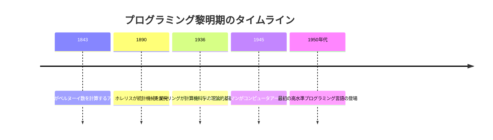

バベッジの機械は実際には完成しませんでしたが、ラブレスの手法は、後のプログラミング言語の先駆けとなりました。彼女は単なる計算だけでなく、機械が数列や音楽などの記号を操作できる可能性を予見していました。

> **ベテランの知恵袋**：アルゴリズム思考は実際のコーディングよりもはるかに重要です。エイダ・ラブレスは一行のコードも書かずに最初のプログラマーになりました。彼女は問題を段階的に分解し、論理的な流れに従って解決する方法を考え出したのです。今日でも、優れたプログラマーはコーディングの前に問題解決の手順を明確に考えることに時間を費やします。

### 1.2 電子計算機の誕生とプログラミングの始まり

第二次世界大戦中、複雑な計算を迅速に行う必要性から、ENIACのような最初の電子計算機が開発されました。これらの初期のコンピュータは、現代の基準からするとプリミティブでしたが、プログラミングの基礎的な概念が形成された重要な時期でした。

当時のプログラミングは現代とは大きく異なっていました。ENIACをプログラミングするためには、物理的にスイッチとケーブルを再配置する必要がありました。プログラムは「ハードウェア」と密接に結びついており、ソフトウェアという概念はまだ確立されていませんでした。

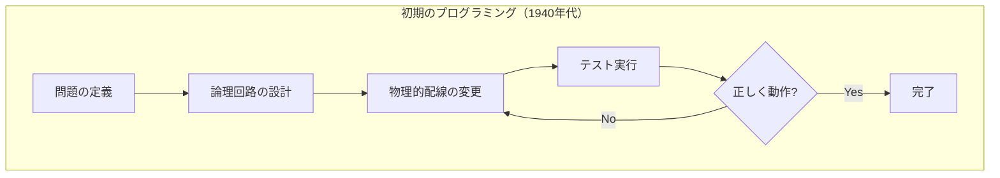

> **プロジェクト事例**：ENIACのプログラマーたちは、その多くが女性でした。「ENIAC Six」として知られるこれらの女性たちは、物理的な配線変更という手作業でプログラミングを行い、複雑な弾道計算を可能にしました。彼女たちの仕事は長い間認識されていませんでしたが、現在では初期のソフトウェア開発の先駆者として評価されています。彼女たちは、マニュアルもテキストブックもない状態で、試行錯誤を通じてプログラミングを学びました。

### 1.3 世界初のプログラミング言語：機械語からアセンブリへ

初期のコンピュータプログラミングでは、プログラマーは機械語（バイナリコード）を直接扱っていました。これは0と1の羅列で、人間にとっては扱いづらいものでした。

この問題を解決するために登場したのが「アセンブリ言語」です。アセンブリ言語では、機械語命令に対応する記号的な命令（ニーモニック）を使用することができました。これにより、プログラミングはやや人間に理解しやすくなりましたが、依然として低レベルで機械に近い言語でした。

アセンブリ言語の登場は、人間とコンピュータの間の最初の抽象化レイヤーを提供し、プログラミングをより効率的にしました。しかし、アセンブリ言語は特定のコンピュータアーキテクチャに依存するため、プログラムの移植性は限られていました。

> **若手の疑問解決**：
> 
> Q: 現代でもアセンブリ言語は使われているのですか？
> 
> A: はい、使われています。特に組み込みシステムや、パフォーマンスが極めて重要なアプリケーションの一部では今でもアセンブリ言語が使用されています。例えば、ゲームエンジンの性能クリティカルな部分、デバイスドライバ、リアルタイムオペレーティングシステムの一部などです。ただし、大半のプログラミングは高水準言語で行われています。

### 1.4 理論的基盤：チューリングとフォン・ノイマン

プログラミングの理論的基盤として、アラン・チューリングとジョン・フォン・ノイマンの貢献は特筆に値します。チューリングは「チューリングマシン」という抽象的な計算モデルを考案し、「計算可能性」の概念を定義しました。一方、フォン・ノイマンは「stored-program」の概念を発展させ、現代のコンピュータアーキテクチャの基礎を築きました。

これらの理論的な進歩により、プログラミングの概念が明確になり、後のプログラミング言語の発展に大きな影響を与えました。

> **失敗から学ぶ**：チューリングの偉大な功績にもかかわらず、彼は同性愛を理由に当時の英国政府から迫害を受けました。彼の早すぎる死は、科学界にとって大きな損失でした。この歴史的失敗は、多様性を尊重しイノベーションを促進する包括的な環境の重要性を教えています。現代のプログラミングコミュニティは、この教訓を胸に、より多様で包括的な文化の構築を目指しています。

---

## 第2章：初期プログラミング言語の物語

### 2.1 FORTRAN：科学計算の先駆者

1957年にIBMによって開発されたFORTRAN（FORmula TRANslation）は、最初の高水準プログラミング言語の一つとして歴史に名を刻みました。それまでのアセンブリ言語と比較して、FORTRANは数学的表現に近い形で科学的計算をプログラムすることを可能にしました。

FORTRANの革新的な点は、コンパイラの存在でした。コンパイラは高水準言語を機械語に変換するプログラムで、プログラマーが直接機械語やアセンブリを書く必要がなくなりました。


FORTRANは特に科学技術計算に強みを持ち、NASA（アメリカ航空宇宙局）のミッションなどでも使用されました。驚くべきことに、FORTRANは現在でも高性能コンピューティングの分野で使用されています。

> **プロジェクト事例**：アポロ計画のミッションコントロールシステムは部分的にFORTRANで書かれていました。1969年、人類を月に送るという前代未聞のプロジェクトにおいて、FORTRANコードは軌道計算という重要な役割を担いました。限られたコンピューティングリソースの中、FORTRANプログラマーたちは最大限の効率を絞り出すために創意工夫を凝らしました。

### 2.2 COBOL：ビジネスの言語

1959年に開発されたCOBOL（Common Business-Oriented Language）は、ビジネスデータ処理のために設計されました。グレース・ホッパー提督の指導のもと、COBOLは英語に近い構文を採用し、非技術者でも理解しやすいプログラミング言語を目指しました。

COBOLの特徴は、大量のデータ処理と記録管理に優れていることでした。そのため、銀行や保険会社、政府機関などで広く採用されました。

> **ベテランの知恵袋**：COBOL開発者たちが目指したのは「プログラマーだけでなく、マネージャーも読めるコード」でした。彼らは言語設計において可読性を最重視しました。この哲学は今日でも重要です。優れたコードは単に動作するだけでなく、他の人が理解し、維持できるものでなければなりません。これは特に長期的なビジネスアプリケーションでは極めて重要です。

興味深いことに、COBOLは「古代の言語」と揶揄されることもありますが、世界の金融システムの多くは依然としてCOBOLで動いています。特に銀行のレガシーシステムでは、信頼性が実証されているCOBOLコードが今でも使われています。

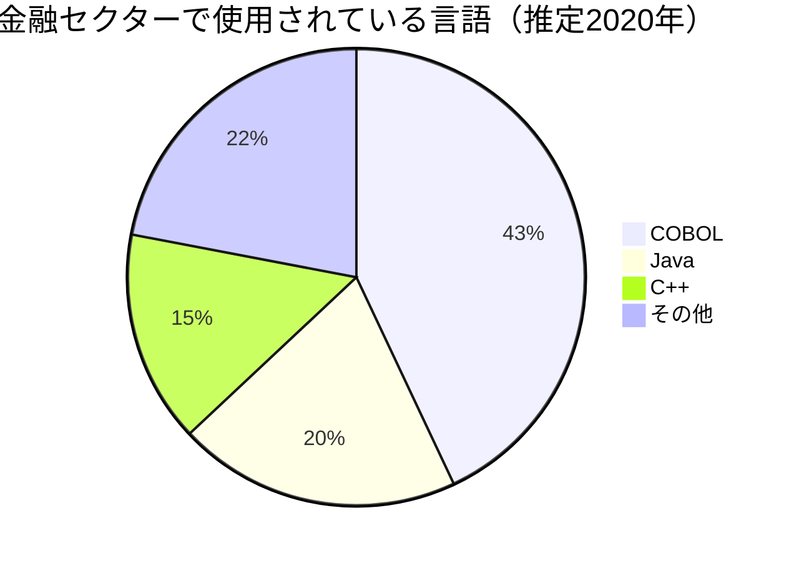

> **若手の疑問解決**：
> 
> Q: なぜ古い言語であるCOBOLのプログラマーが今でも求められるのですか？
> 
> A: これは「技術的負債」と「システムの重要性」の問題です。多くの重要な金融システムがCOBOLで書かれており、これらを書き換えるにはコストとリスクが非常に高いです。そのため、既存のCOBOLシステムを維持・更新できるプログラマーが今でも必要とされています。COBOLプログラマーの多くが退職年齢に近づく中、この需要は実際に増加傾向にあります。

### 2.3 LISP：人工知能の母語

1958年にジョン・マッカーシーによって開発されたLISP（LISt Processing）は、人工知能研究のために設計されました。LISPは非常に特徴的な構文を持ち、すべてがリスト構造として表現されます。

LISPの最も革新的な特徴の一つは、「コードがデータ、データがコード」という概念でした。LISPでは、プログラム自体もデータとして扱うことができ、これにより「メタプログラミング」（プログラムを書くプログラム）が可能になりました。

> **プロジェクト事例**：1990年代、シマンテック社はLISPの方言であるILOOP言語を使用して、当時としては革新的なユーザーインターフェースを持つ文書作成ソフトウェア「Symantec Q&A Write」を開発しました。LISPの強力な表現力と柔軟性により、開発チームは短期間で複雑な機能を実装できました。このプロジェクトは、適切な言語選択がどのようにプロジェクトの成功に影響するかを示す好例です。

LISPは学術界、特に人工知能の研究で広く使用され、Emacsなどのテキストエディタや一部のゲームエンジンなど、様々なソフトウェアの開発にも影響を与えました。

### 2.4 BASIC：プログラミングを民主化した言語

1964年にダートマス大学のジョン・ケメニーとトーマス・カーツによって開発されたBASIC（Beginner's All-purpose Symbolic Instruction Code）は、初心者がプログラミングを学ぶためのシンプルな言語として設計されました。

BASICは教育目的で始まりましたが、1970年代から1980年代にかけてのパーソナルコンピュータ革命の中で大きな役割を果たしました。多くの初期のPCにはBASICインタープリタが搭載されており、一般の人々がプログラミングに触れる最初の機会となりました。

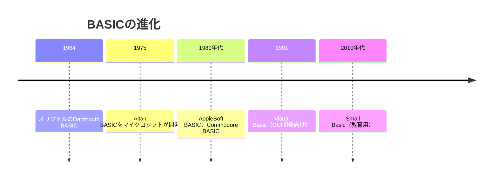

> **コラム：ビル・ゲイツとポール・アレンの出会い**
> 
> マイクロソフトの共同創業者ビル・ゲイツとポール・アレンの友情は、実はBASICプログラミングから始まりました。二人は学生時代にコンピュータクラブで出会い、一緒にBASICプログラムを書いていました。後に彼らは最初の製品として「Altair BASIC」を開発し、これがマイクロソフト創業のきっかけとなりました。このように、BASICはただの言語ではなく、現代のテクノロジー産業の形成に深く関わっています。

BASICの遺産は今日でも続いており、Visual BasicやVBAといった形で企業のシステムやマクロプログラミングに生きています。

### 2.5 Pascal：構造化プログラミングの教科書

1970年にニクラウス・ウィルトによって開発されたPascalは、プログラミング教育のために設計された言語でした。Pascalは強い型付けと構造化プログラミングの原則に基づいており、「正しい」プログラミング手法を教えることを目的としていました。

Pascalは特に1980年代から1990年代にかけて、大学のコンピュータサイエンス教育で広く使用されました。その明確な構文と論理的な構造により、初心者がプログラミングの基本原則を学ぶのに適していました。

> **ベテランの知恵袋**：Pascalが教えてくれた最大の教訓は「制約が創造性を生む」ということです。Pascalは意図的に制約の多い言語として設計され、それによってプログラマーに規律を教えました。今日でも、すべてを許容する言語より、適切な制約があるフレームワークの方が、大規模で保守可能なコードベースを作るには効果的です。

Pascalの影響は後に開発されたObjective-C（Appleの開発環境の基礎となった言語）やDelphiなどの言語にも見られます。

> **若手の疑問解決**：
> 
> Q: なぜ教育用の言語が必要なのでしょうか？実用的な言語を最初から学べばいいのでは？
> 
> A: 教育用言語はプログラミングの基本概念を学ぶための「足場」を提供します。実用的な言語は往々にして複雑で、多くの例外的なケースや歴史的な理由による癖を持っています。これは実務では必要ですが、初学者の混乱を招きがちです。例えば、C++やJavaScriptを最初から学ぶと、言語の複雑さに圧倒されることがあります。Pascalのような教育用言語は、基本原則を明確に理解するための環境を提供します。

---

## 第3章：パーソナルコンピューティングの時代

### 3.1 C言語：OSの根幹を支える言語

1972年にベル研究所のデニス・リッチーとケン・トンプソンによって開発されたC言語は、UNIXオペレーティングシステムの開発のために設計されました。Cはハードウェアに近い制御を可能にしながらも、ある程度の抽象化と移植性を提供するという絶妙なバランスを持った言語でした。

Cの重要な特徴は、効率性と移植性の両立でした。Cコンパイラは様々なハードウェアプラットフォーム向けに作られ、これにより「一度書けば、どこでも動く」（少なくとも再コンパイルすれば）というアプローチが可能になりました。

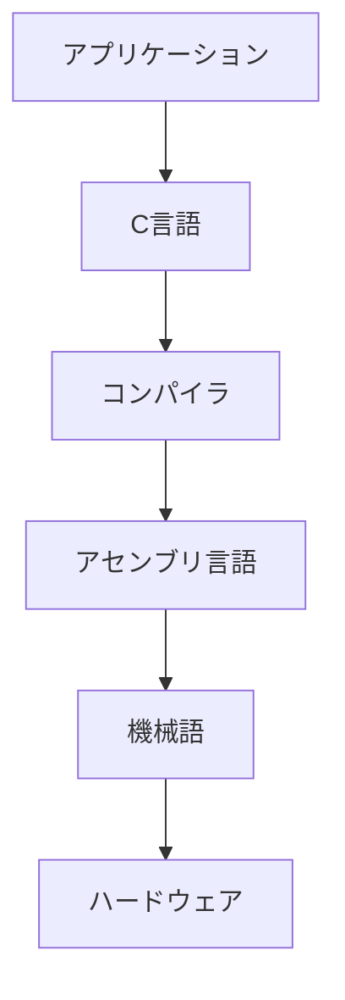

> **プロジェクト事例**：Linuxカーネルは、C言語で書かれた最も成功したオープンソースプロジェクトの一つです。1991年にフィンランドの学生リーナス・トーバルズによって始められたこのプロジェクトは、当初は個人的な趣味プロジェクトでしたが、今では世界中のサーバー、スマートフォン（Android）、組み込みデバイスで動作しています。Cの効率性と移植性がなければ、Linuxの普及はこれほどまでにならなかったでしょう。

Cは今でも、オペレーティングシステム、ドライバ、組み込みシステム、高性能コンピューティングなど、パフォーマンスと直接的なハードウェア制御が重要な場面で広く使用されています。

### 3.2 C++：オブジェクト指向への進化

1983年にビャーネ・ストロヴストラップによって開発されたC++は、Cに「オブジェクト指向プログラミング」の概念を追加した言語です。C++の名前はCの拡張を象徴しており、「C+1」から発展しました。

C++は大規模なソフトウェア開発のための新しいパラダイムを提供しました。特に、「カプセル化」「継承」「ポリモーフィズム」といった概念を導入し、コードの再利用性と拡張性を向上させました。

> **ベテランの知恵袋**：C++の設計者ストロヴストラップが言った言葉に「C++は多機能ナイフであって、電動のこぎりではない」というものがあります。これは、言語の設計において意図的に選択肢を提供していることを意味します。特定の解決策を強制するのではなく、プログラマーに様々なアプローチを可能にするという哲学です。この選択の自由は強力ですが、同時に責任も伴います。より良いプログラマーになるということは、どのツールをいつ使うべきかを理解することでもあるのです。

C++は、Adobe Photoshop、Microsoft Office、多くのゲームエンジン、トレーディングシステムなど、パフォーマンスが重要なデスクトップアプリケーションの開発に広く使用されています。

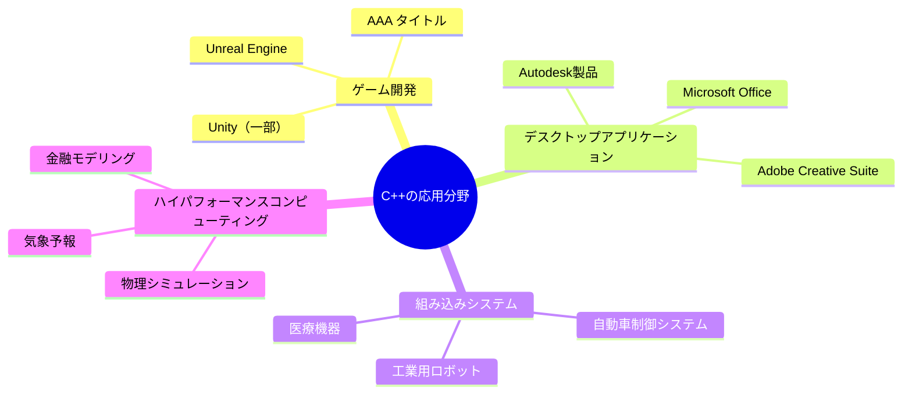

> **失敗から学ぶ**：C++の複雑さが招いた有名な失敗例に「Mars Climate Orbiter」の喪失があります。1999年、NASAの火星気候探査機は単位変換の問題（ポンド力とニュートンの混同）により軌道計算を誤り、火星大気中で消失しました。これはC++のような型安全を提供する言語でも、インターフェース間での単位の一貫性を保証するためには、言語機能を超えた設計レビューと検証が必要であることを示しています。この教訓は現代のソフトウェア開発でも重要です。

### 3.3 Visual Basic：GUIプログラミングの民主化

1991年にマイクロソフトによって発表されたVisual Basic（VB）は、グラフィカルユーザーインターフェース（GUI）アプリケーションの開発を大幅に簡素化しました。それまでのGUI開発は専門的な知識を必要としていましたが、VBの「フォーム」ベースの開発環境は、視覚的にアプリケーションを構築することを可能にしました。

Visual Basicの革新点は、「RAD（Rapid Application Development）」アプローチを普及させたことでした。プログラマーはドラッグ＆ドロップでUIを構築し、各コンポーネントに対するイベントハンドラ（ボタンがクリックされたときに実行されるコードなど）を書くことでアプリケーションを作成できました。

> **コラム：アラン・クーパーとVBの誕生**
> 
> Visual Basicの原型は、ソフトウェアデザイナーのアラン・クーパーが開発した「Ruby」（後の「Tripod」）というプロトタイピングツールでした。マイクロソフトはこの技術を買収し、BASICとの統合を進めてVisual Basicを誕生させました。クーパーは後に『The Inmates Are Running the Asylum』という書籍を著し、ユーザー中心設計の重要性を説きました。彼の視点は「プログラマーのためのプログラミング言語」から「ユーザーのためのソフトウェア設計」へと進化し、現代のUXデザインの礎となっています。

Visual Basicは特に企業内部のアプリケーション開発に革命をもたらしました。IT部門の専門家だけでなく、部門の「パワーユーザー」でも業務アプリケーションを開発できるようになったのです。

> **若手の疑問解決**：
> 
> Q: 「ビジュアル」プログラミングは今でも続いているのですか？
> 
> A: はい、その精神は今日も様々な形で生きています。モダンな開発環境（IDE）の多くはUIデザイナーを提供しており、Visual Studio、Android Studio、Xcodeなどでは視覚的にインターフェースを構築できます。さらに、Scratch、AppInventor、Node-REDのような完全にビジュアルなプログラミング環境もあります。「ノーコード」「ローコード」プラットフォームも、Visual Basicの哲学を発展させたものと見ることができます。

### 3.4 Perl：テキスト処理の魔術師

1987年にラリー・ウォールによって開発されたPerlは、当初UNIXシステム管理者のためのテキスト処理ツールとして設計されました。「Practical Extraction and Reporting Language」（一説には「Pathetically Eclectic Rubbish Lister」とも）の略称であるPerlは、正規表現を使った強力なテキスト処理能力で知られるようになりました。

Perlの特徴は「TWTDIという文化でした - "There's More Than One Way To Do It"（やり方は一つではない）というフレーズがPerlの柔軟性を象徴しています。この柔軟性はユーザーに創造性を発揮する自由を与えましたが、時に読みにくいコードを生み出すこともありました。

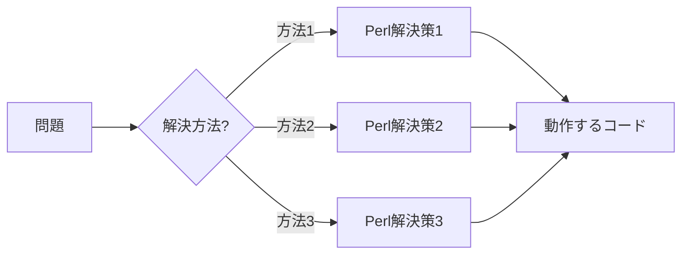

> **コラム：「書いたときは理解できた」症候群**
> 
> 経験豊かなPerlプログラマーの間で語り継がれる冗談に「書いたときは理解できたのに…」というものがあります。Perlの柔軟性と簡潔な構文により、非常に短いコードで複雑な処理を実現できるのですが、数週間後に同じコードを見直すと、何をしているのか理解するのに時間がかかることがあります。これは「Perlの書き捨てパラドックス」と呼ばれることもあります：使い捨てのスクリプトを書くのには最適な言語ですが、そのスクリプトがあまりにも有用なため、結局は長期的に保守する必要が生じるのです。この経験から、「明日の自分のためにコメントを書く」という習慣が生まれました。

Perlは特にウェブの初期段階で重要な役割を果たし、CGI（Common Gateway Interface）スクリプトを通じて動的なウェブページを可能にしました。また、テキスト処理とシステム管理のタスクでは今でも使用されています。

> **プロジェクト事例**：Amazon.comの初期のウェブサイトは、Perlで書かれたCGIスクリプトを使用して構築されました。1995年、オンライン書店として始まったAmazonは、カタログの検索・表示・注文処理にPerlを活用していました。当時のウェブ技術では、大規模なデータベースを処理し、動的なページを生成するためにPerlの強力なテキスト処理能力は理想的でした。今日のAmazonはもちろんはるかに複雑なシステムになっていますが、初期の急成長を支えたのはPerlのおかげでもあったのです。

---

## 第4章：インターネット革命とウェブ言語

### 4.1 HTML & CSS：ウェブの構造とデザイン言語

1990年代初頭、ティム・バーナーズ・リーによって開発されたHTML（HyperText Markup Language）は、ウェブページの構造を定義するためのマークアップ言語として誕生しました。HTMLは厳密にはプログラミング言語ではありませんが、ウェブの基礎として重要な役割を果たしています。

HTMLが文書の構造を定義するのに対し、1996年に導入されたCSS（Cascading Style Sheets）はその見た目やレイアウトを制御します。この分離はウェブ開発の重要な原則となりました：「内容と表示の分離」です。

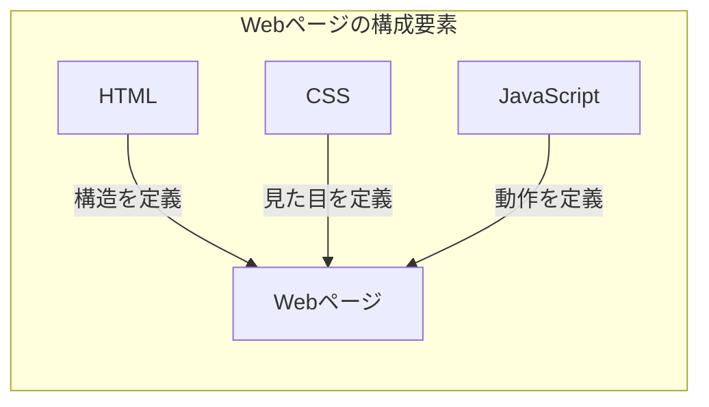

> **若手の疑問解決**：
> 
> Q: なぜHTMLやCSSはプログラミング言語と呼ばれないのですか？
> 
> A: プログラミング言語の定義には「条件分岐」や「ループ」などの制御構造が含まれるのが一般的です。HTMLやCSSはマークアップ言語や宣言型言語であり、「何を表示するか」を記述するもので、「どのように処理するか」のロジックを持ちません。単純に言えば、HTMLやCSSで「if-then」のような条件付き処理を行うことはできません（CSS変数や計算はありますが、完全なプログラミング機能はありません）。ただし、近年のCSS（特にCSS Grid、Flexbox、アニメーション）はかなり複雑になってきており、境界線は少し曖昧になってきています。

HTMLとCSSは、ウェブの発展とともに進化してきました。最新のHTML5とCSS3は、リッチなインタラクティブ体験とレスポンシブデザインを可能にしています。

### 4.2 JavaScript：ウェブにインタラクティブ性をもたらした言語

1995年、ネットスケープ社のブレンダン・アイクによって開発されたJavaScriptは、当初ウェブページに簡単なインタラクティブ性を追加するための言語として設計されました。わずか10日間で設計されたこの言語は、当初は軽視されることもありましたが、現在ではウェブ開発の中心的な言語となっています。

JavaScriptの名前はマーケティング上の理由でJavaに似せられましたが、実際には両者は全く異なる言語です。この名前の混同は、長年にわたり初心者の混乱の原因となってきました。

> **失敗から学ぶ**：JavaScriptの急速な開発は、後に「レガシー機能」と呼ばれる問題を生み出しました。特に「var」キーワードやグローバルスコープの仕組みは、大規模アプリケーションでバグの原因となりやすいものでした。これらの問題は後のES6（ECMAScript 2015）で改善されましたが、後方互換性のために完全に除去することはできません。この教訓は、言語設計においては急ぐことなく、将来の拡張性を考慮することの重要性を示しています。今日の言語設計者たちは、JavaScriptの失敗から学び、より堅牢な基盤を築くことに注力しています。

JavaScriptの大きな転換点は2009年のNode.jsの登場でした。これにより、JavaScriptはブラウザだけでなくサーバーサイドでも実行できるようになり、「フルスタック」開発言語となりました。

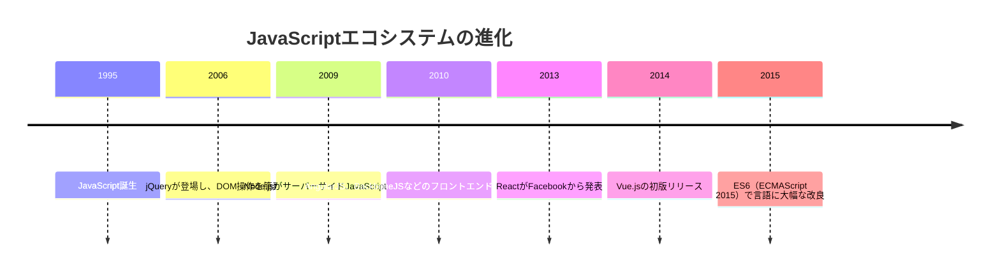

現在のJavaScriptエコシステムは非常に豊かで、React、Angular、Vueなどのフロントエンドフレームワークや、Express、Nest.jsなどのバックエンドフレームワーク、そしてElectron（デスクトップアプリ開発）やReact Native（モバイルアプリ開発）など、多様な用途に対応しています。

> **ベテランの知恵袋**：JavaScriptの歴史から学べる重要な教訓は「適応性の価値」です。JavaScriptは決して完璧な言語ではありませんでしたが、その柔軟性により様々な用途に適応してきました。プログラミングキャリアにおいても同様です。特定の言語やフレームワークに固執するよりも、新しい概念やパラダイムに適応する能力を培うことが長期的な成功につながります。技術は常に変化しますが、学習と適応の能力は普遍的な価値を持ちます。

### 4.3 PHP：ウェブ開発を手軽にした言語

1994年にラスマス・ラードフによって開発されたPHP（originally Personal Home Page Tools, later PHP: Hypertext Preprocessor）は、当初ラードフの個人ウェブサイトを維持するための小さなツールセットでした。それが進化して、ウェブ開発のための人気言語となりました。

PHPの主な強みは、HTMLコードの中に直接埋め込めることで、動的ウェブコンテンツの作成が容易になりました。また、データベース連携が簡単であることも、その普及に貢献しました。

> **プロジェクト事例**：2003年に大学生だったマーク・ザッカーバーグは、PHPを使って初期のFacebookを開発しました。簡単に学べて迅速に開発できるPHPの特性が、スタートアップの急速な成長を可能にしました。当初はハーバード大学の学生向けの単純なソーシャルネットワークでしたが、PHPの柔軟性により、成長するユーザーベースに合わせて機能を迅速に追加・改善することができました。Facebookはその後、パフォーマンス向上のためにPHPの独自バージョン「HipHop for PHP」を開発し、最終的にはHackという言語に進化させました。

PHPは特に初心者に優しい入門点となり、WordPressやDrupalといった人気のコンテンツ管理システム（CMS）の基盤となりました。現在でも、ウェブの相当な部分がPHPで動作しています。

> **ベテランの知恵袋**：PHPの経験から学べる重要な教訓は「完璧を求めるよりも、まず動かすことの価値」です。PHPは設計の美しさよりも実用性を重視した言語です。多くの批判にもかかわらず、PHPは「仕事をこなす」言語として成功しました。実際のプロジェクトでは、理論的に完璧なソリューションよりも、期限内に動作する解決策を提供することが往々にして重要です。完璧主義に陥らず、まずはMVP（Minimum Viable Product：実用最小限の製品）を作り、そこから改善していく姿勢は、多くの成功するプロジェクトに共通しています。

### 4.4 Ruby on Rails：「規約より設定」を広めたフレームワーク

2004年にデンマークのデビッド・ハイネマイヤー・ハンソンによって開発されたRuby on Rails（通称Rails）は、Rubyプログラミング言語に基づくウェブアプリケーションフレームワークです。Railsはウェブ開発の概念を大きく変え、「規約より設定」（Convention over Configuration）という哲学を広めました。

Railsの革新的なアプローチは、開発者が設定ファイルをいじる時間を減らし、実際のビジネスロジックに集中できるようにすることでした。標準的な命名規則や構造に従うことで、多くの設定を自動化しました。

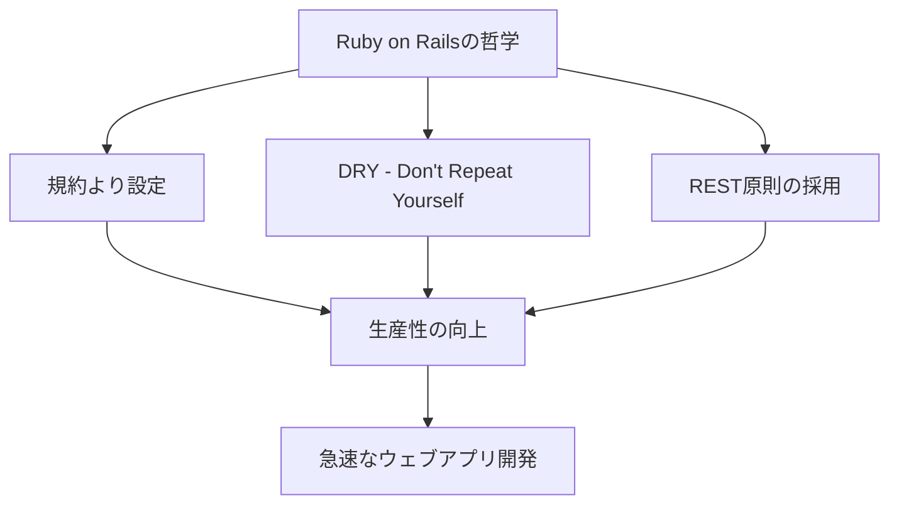

> **コラム：37signals と Rails の起源**
> 
> Ruby on Railsは、ウェブデザイン会社37signals（現Basecamp）がプロジェクト管理ツール「Basecamp」を開発する過程で生まれました。ハンソンはBasecampの開発中に作成したフレームワークをオープンソース化し、それがRailsとなりました。興味深いことに、37signalsはユーザーインターフェースの簡素化と実用性を重視する設計哲学で知られており、この「シンプルさの追求」がRailsの設計にも反映されています。彼らの著書『Getting Real』と『Rework』は、ソフトウェア開発だけでなく、ビジネス全般に大きな影響を与えました。

Railsはスタートアップでの採用が多く、Twitter（初期バージョン）、Airbnb、GitHub、Shopifyなどの成功企業で使用されました。その迅速な開発サイクルは、「MVPを素早く市場に投入する」というスタートアップの理念に合致していました。

> **若手の疑問解決**：
> 
> Q: 「規約より設定」とは具体的にどういう意味ですか？
> 
> A: 従来のフレームワークでは、データベーステーブルとプログラムオブジェクトの紐付けなど、多くの設定を手動で行う必要がありました。一方、Railsでは「Userモデルはusersテーブルにマッピングされる」というような規約に従うだけで、自動的に多くのことが行われます。これにより、開発者はボイラープレートコード（繰り返し書かれる定型的なコード）を書く手間が省け、ビジネスロジックに集中できます。シンプルな例として、データベーステーブル「users」と「posts」があり、ユーザーが複数の投稿を持つモデルをRailsで作る場合、わずか数行のコードで関連するCRUD操作（Create, Read, Update, Delete）が実装できます。

---

## 第5章：モバイルの台頭とアプリ開発の世界

### 5.1 Java：「一度書けばどこでも動く」の約束

1995年にサン・マイクロシステムズによって開発されたJavaは、「Write Once, Run Anywhere」（一度書けばどこでも動く）という野心的な目標を掲げていました。Javaの中心的な革新はJava Virtual Machine（JVM）で、これにより、異なるプラットフォーム向けに再コンパイルすることなく、同じコードを様々な環境で実行できるようになりました。

Javaは企業システムで広く採用され、特にバックエンド開発とAndroidアプリ開発で重要な役割を果たしています。

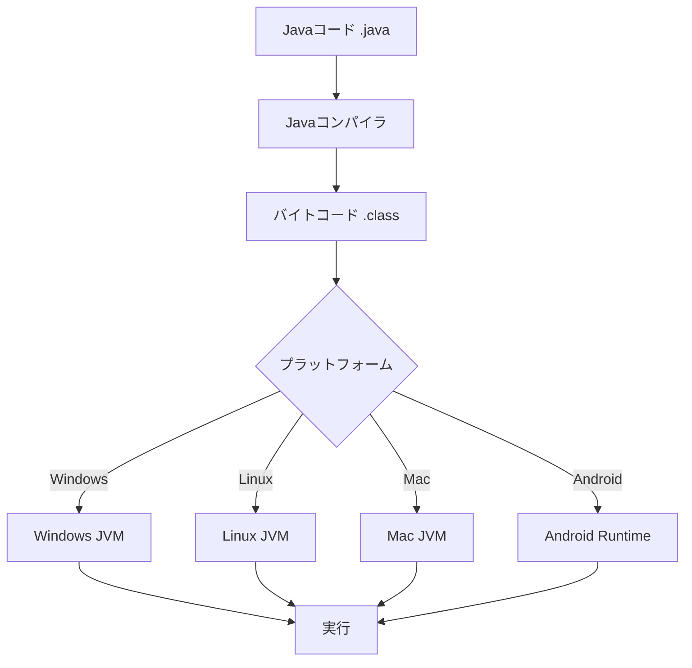

> **プロジェクト事例**：2008年、モンゴメリー郡の公立学校システムは既存の学生情報システムをJavaベースのシステムに移行するプロジェクトを開始しました。このプロジェクトは当初、18ヶ月の期間と500万ドルの予算で計画されていましたが、最終的には3年以上かかり、コストも3倍に膨れ上がりました。問題の主な原因は、Javaの「企業向け」フレームワークの複雑さと、要件の頻繁な変更でした。このプロジェクトの教訓は、技術選択だけでなく、プロジェクト管理と要件定義の重要性を示しています。また、「エンタープライズ・ソフトウェア」が必ずしも優れているわけではなく、時にはシンプルなソリューションの方が成功する可能性が高いことも示唆しています。

Javaの強みは、強力な型システム、豊富なライブラリエコシステム、そして成熟した開発ツールにあります。これらの特徴は、特に大規模な企業システムの開発において価値を発揮します。

> **ベテランの知恵袋**：Java の世界には「ボイラープレート・コード」と呼ばれる現象があります。これは、実際のビジネスロジックを実装する前に書かなければならない定型的なコードのことです。例えば、単純なデータモデルを作るだけでも、多くのgetter/setterメソッドやコンストラクタを書く必要があります。これは言語の明示性と安全性を高める一方で、開発速度を低下させる可能性があります。多くの経験豊富なJava開発者は、IDEの自動生成機能やLombokのようなライブラリを活用して、このボイラープレートの問題に対処しています。プログラミングにおいては、言語の哲学を理解し、その強みを活かしながら弱点を軽減する方法を学ぶことが重要です。

### 5.2 Swift & Objective-C：Appleのエコシステムを支える言語

Objective-Cは1980年代に開発され、後にNeXTコンピュータ（スティーブ・ジョブズが創設した会社）で採用され、最終的にAppleのiOSとmacOSの開発言語となりました。一方、Swiftは2014年にAppleが発表した、よりモダンで安全なプログラミング言語です。

Objective-Cの特徴は、CとSmalltalkの影響を受けた独特の構文でした。これは学習曲線が急で、特に他の主流言語に慣れた開発者にとっては難しいものでした。Swiftはこの問題に対処するために設計され、より読みやすく、安全で、モダンな構文を提供しています。

> **コラム：スティーブ・ジョブズとNeXTの遺産**
> 
> 興味深いことに、現代のApple製品の中核となっている多くの技術は、スティーブ・ジョブズがAppleを離れていた期間に創設したNeXTコンピュータに端を発しています。NeXTStepオペレーティングシステムは、Objective-Cと優れたオブジェクト指向フレームワークを採用していました。Appleが1997年にNeXTを買収してジョブズが復帰したとき、このNeXTの技術はmacOSとiOSの基礎となりました。これは、最先端の技術が必ずしもすぐに市場で成功するとは限らないが、長期的には重要な影響を与える可能性があることを示す例です。一時的な「失敗」と見なされたNeXTの技術が、最終的にAppleの復活とiPhone、iPadの成功に不可欠だったというのは、技術開発における忍耐と長期的視野の価値を示しています。

Swift は、型安全性、オプショナル型、パターンマッチングなど、モダンな言語機能を導入し、iOS、macOS、watchOS、tvOSなどのAppleプラットフォーム向けアプリ開発を簡素化しました。

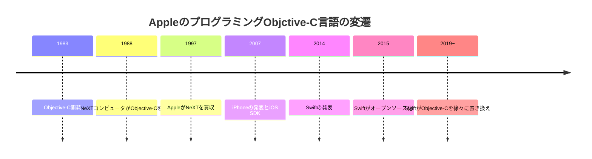

> **若手の疑問解決**：
> 
> Q: なぜAppleは完全にObjective-CからSwiftに移行しないのですか？
> 
> A: これは「レガシーコード」と「後方互換性」の問題です。何百万行ものObjective-Cコードがすでに存在し、多くのアプリやシステムコンポーネントがそれに依存しています。すべてを一度に書き換えるのは非常にコストがかかり、リスクも高いです。そのため、Appleは段階的な移行アプローチを取っています。新しいコードはSwiftで書き、既存のObjective-Cコードは時間をかけて置き換えていくというものです。さらに、SwiftとObjective-Cは相互運用性があるため、同じプロジェクト内で両方の言語を使用することができます。これは大規模なシステムを進化させる際の一般的なアプローチです。

### 5.3 Kotlin：Javaの後継者として台頭する言語

2011年にJetBrainsによって開発されたKotlinは、JVM上で動作する比較的新しいプログラミング言語です。Kotlinは2017年にGoogleがAndroid開発の公式言語として認定したことで大きな注目を集めました。

Kotlinの主な目標は、Javaの冗長性と制限を解消しつつ、既存のJavaコードと100%の互換性を維持することでした。その結果、より簡潔で表現力豊かなコードが可能になり、同時に既存のJavaプロジェクトへの段階的な導入も容易になりました。

> **プロジェクト事例**：Trello（人気のプロジェクト管理ツール）のAndroidアプリ開発チームは、2017年にJavaからKotlinへの移行を決定しました。この移行は段階的に行われ、新しい機能はKotlinで書き、既存のJavaコードは必要に応じて少しずつ変換していきました。開発者たちは、Kotlinのnullセーフティ機能により、以前はランタイムで発生していた「NullPointerException」が大幅に減少し、アプリの安定性が向上したと報告しています。また、コードの行数が約30%減少し、より読みやすく保守しやすいコードベースになりました。このプロジェクトは、適切な言語選択が開発効率と製品品質の両方に大きな影響を与える例として注目されています。

Kotlinの主な特徴には、null安全性、拡張関数、コルーチン（非同期プログラミングの簡素化）などがあり、これらによりより安全で簡潔なコードが可能になります。

> **ベテランの知恵袋**：Kotlinの成功から学べる重要な教訓は、「破壊的変革よりも進化的改良」の価値です。Kotlinの設計者たちは、全く新しいものを作るのではなく、既存のエコシステム（JVM）の上に構築し、既存の資産（Javaコードベース）を活用できるようにしました。この「革命ではなく進化」というアプローチにより、企業はリスクを最小限に抑えながら新技術を採用することができます。自分のキャリアを考える際も同様です。既存のスキルや知識を基盤として、そこから新しい領域に進出することで、より持続可能な成長が可能になります。

---

## 第6章：現代のプログラミングエコシステム

### 6.1 Python：シンプルさと汎用性を両立した言語

1991年にグイド・ヴァン・ロッサムによって開発されたPythonは、読みやすく書きやすい構文と強力な機能を兼ね備えた言語として設計されました。Pythonの哲学は「The Zen of Python」に集約されており、その中心にあるのは「明示的であることは暗黙的であることよりも優れている」「シンプルさは複雑さに勝る」といった原則です。

Pythonの強みは、初心者にも優しい言語でありながら、科学計算、機械学習、ウェブ開発、自動化など、幅広い用途に対応できる汎用性です。

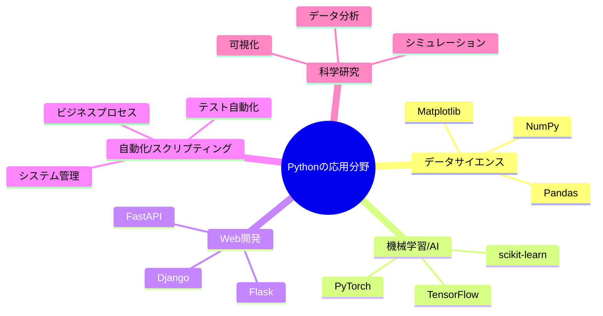

> **プロジェクト事例**：Instagram（当初は「Burbn」という名前）は、ケヴィン・システロムとマイク・クリーガーによって2010年に立ち上げられ、Pythonベースのウェブフレームワーク「Django」を使用して構築されました。当時、多くのスタートアップがRuby on Railsを選択していた中、InstagramのチームはPythonとDjangoを選びました。この決定は、Djangoの「バッテリー同梱（すぐに使える機能が豊富）」の哲学と安定性に基づいていました。Instagramは急速に成長し、2012年にFacebookに10億ドルで買収される前に、わずか2年で1000万ユーザーを獲得しました。現在、Instagramは10億人以上のユーザーを抱え、そのバックエンドの多くは今でもPythonで動作しています。この成功事例は、適切な技術選択と、シンプルで焦点を絞った製品戦略の重要性を示しています。

Pythonは特に「グルー言語」として優れており、異なるシステムやコンポーネントを繋ぐ役割を果たします。また、その読みやすい構文と豊富なドキュメントにより、チーム間のコラボレーションを促進します。

> **ベテランの知恵袋**：Pythonのコミュニティには「Pythonic」という概念があります。これは単に「Pythonで書かれている」という意味ではなく、「Pythonの哲学と慣習に従ったエレガントなコード」を表します。例えば、複雑なループの代わりにリスト内包表記を使用したり、生の例外処理よりもcontext managerを使用したりすることがPythonicです。どの言語にも独自の「流儀」があり、その言語で真に熟達するためには、単に構文を覚えるだけでなく、その言語のコミュニティの価値観や慣習を理解することが重要です。Pythonの「batteries included」（必要なものが標準ライブラリに含まれている）という哲学も、「車輪の再発明をせず、既存のツールを活用する」という重要な教訓です。

### 6.2 Go：シンプルさとパフォーマンスを追求した言語

2009年にGoogleによって開発されたGo（または「Golang」）は、Cの効率性とモダン言語の使いやすさを兼ね備えることを目指した言語です。Go はロバート・グリーズマー、ロブ・パイク、ケン・トンプソン（UNIXとC言語の開発者の一人）という著名なコンピュータサイエンティストによって設計されました。

Goの主な特徴は、シンプルな構文、強力な並行処理モデル（ゴルーチン）、効率的なコンパイル、優れたパフォーマンスです。特に、クラウドインフラストラクチャやマイクロサービスの開発に適しています。

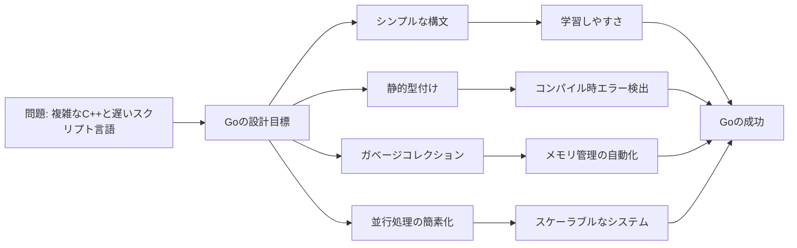

> **コラム：Goが生まれた理由**
> 
> Go言語の開発は、Googleの開発者たちの具体的な不満から始まりました。彼らは大規模なソフトウェアプロジェクトを開発・維持する上での3つの主要な問題に直面していました。1つ目は、C++のような既存の言語が複雑すぎてコンパイルに時間がかかること。2つ目は、従来の言語が現代のマルチコアプロセッサを効率的に活用できないこと。3つ目は、大規模なコードベースを管理する際の依存関係の問題でした。Goはこれらの問題を解決するために作られました。興味深いことに、Go言語の設計文書には「退屈であること」が明示的に目標として挙げられています。これは「注目を集める革新的な機能」よりも「実際に使いやすく保守しやすい言語」を優先する哲学を反映しています。

Goは、Docker、Kubernetes、Prometheus、Terraform、Etcdなど、多くの重要なクラウドインフラストラクチャツールの開発に使用されています。

> **若手の疑問解決**：
> 
> Q: GoとPythonはどちらを学ぶべきですか？
> 
> A: これはよく聞かれる質問ですが、二者択一ではなく、用途によって異なります。Pythonは汎用性が高く、データ分析、機械学習、ウェブ開発、自動化など幅広いタスクに適しています。一方、Goはパフォーマンスが重要なバックエンドサービス、マイクロサービス、クラウドインフラツールの開発に優れています。学習曲線の観点では、Pythonの方が初心者に優しい傾向があります。理想的には、両方を学び、適材適所で使い分けることです。多くの企業では、高速処理が必要なバックエンドサービスにGoを使い、データ分析やスクリプティングにPythonを使うという組み合わせが見られます。

### 6.3 Rust：安全性と効率性を両立させた次世代言語

2010年にMozillaによって開発されたRustは、メモリ安全性を損なうことなく高いパフォーマンスを実現することを目指したシステムプログラミング言語です。従来のC/C++のようなシステム言語では、メモリ管理の間違いがセキュリティ脆弱性や予測不能な動作につながることがありました。Rustはこの問題に、独自の「所有権」モデルで対処しています。

Rustの特徴は、コンパイル時に多くのバグや脆弱性を捕捉できることです。特に「データ競合」（複数のスレッドが同じメモリ領域に同時にアクセスする問題）をコンパイル時に検出できる点は革新的です。

> **ベテランの知恵袋**：優れた言語設計とは、問題を解決することではなく、問題を不可能にすることです。Rustの天才的な点は、メモリ安全性の問題を言語レベルで解決したことにあります。「ボローチェッカー」と呼ばれるRustのコンパイラコンポーネントは、コード内の所有権と借用関係を追跡し、安全でない操作を防ぎます。この「コンパイル時の保証」アプローチは、テストだけでは見つけにくいバグを防ぐという点で、ソフトウェア品質の新しいパラダイムを示しています。この教訓は他の分野にも適用できます：問題が発生した後に対処するよりも、問題が発生しない設計を作ることの方が常に優れています。

Rustは特にセキュリティとパフォーマンスが重要なシステムプログラミングの分野で採用が進んでいます。例えば、Mozilla、Microsoft、Amazonなどの企業がセキュリティクリティカルなコンポーネントの実装にRustを採用し始めています。

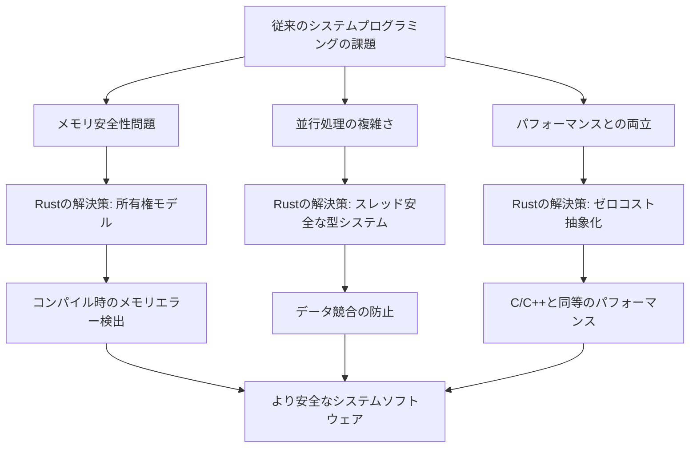

> **プロジェクト事例**：2019年、DropboxはC++で書かれていた同期エンジンの核心部分をRustで書き直すプロジェクトを完了しました。この決断は、パフォーマンスを維持しながらもメモリ安全性を向上させるという目標に基づいていました。プロジェクトの結果、同期エンジンのメモリ使用量が大幅に減少し、以前は難しかった並行処理の実装が容易になりました。さらに、Rustのエラー処理モデルにより、コードの堅牢性が向上しました。Dropboxのエンジニアたちは、学習曲線は急でしたが、長期的なメンテナンス性とバグの減少という点で、その投資は価値があったと報告しています。

### 6.4 TypeScript：スケーラブルなJavaScriptへの進化

2012年にMicrosoftによって開発されたTypeScriptは、JavaScriptに静的型付けを追加した言語です。TypeScriptは、JavaScriptの柔軟性を維持しながら、大規模アプリケーション開発時の問題（型エラーなど）に対処することを目指しています。

TypeScriptの主な革新点は、JavaScriptとの完全な互換性を保ちながら、静的型検査を行う「漸進的型付け」というアプローチです。TypeScriptコードはコンパイル時に検査された後、標準的なJavaScriptに変換されます。

> **失敗から学ぶ**：2016年、ある大手企業は主要な顧客向けウェブアプリケーションを「素のJavaScript」で開発していましたが、コードベースの成長に伴い、予期せぬランタイムエラーやバグが増加していました。特に、オブジェクトのプロパティ名の変更が他の部分に波及する「カスケード効果」が大きな問題でした。彼らはTypeScriptへの移行を決定しましたが、プロジェクト途中での移行は予想以上に困難でした。レガシーコードを型定義なしで「any」型として扱う方法を選んだため、部分的にしか型安全性の恩恵を受けられませんでした。この教訓は、新技術の導入は小規模なプロジェクトから始めるか、新プロジェクトの開始時に行うべきであること、また移行戦略は慎重に計画する必要があることを示しています。

TypeScriptは特に大規模なフロントエンドプロジェクトで採用されており、Angular、React、Vue.jsなどの主要なフレームワークと組み合わせて使用されています。

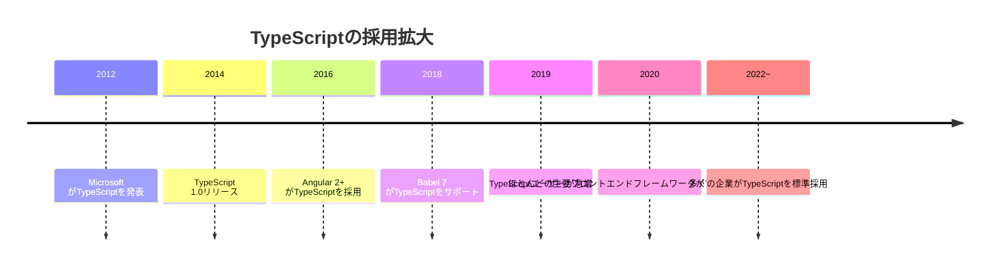

> **ベテランの知恵袋**：TypeScriptの成功は「既存のエコシステムを尊重しながら価値を付加する」アプローチの有効性を示しています。TypeScriptは「JavaScriptを置き換える」のではなく、「JavaScriptを拡張する」ことに焦点を当て、既存のJavaScriptコードと共存する能力を持っています。これにより、チームは「ビッグバン式の置き換え」ではなく、段階的な採用が可能になりました。新技術を導入する際は、既存の投資を無駄にするのではなく、それを基盤にして構築することが賢明です。プログラミングの世界では、「破壊的変革」よりも「進化的向上」の方が成功率が高いことが多いのです。

---

## 第7章：生成AIの衝撃とプログラミングの未来

### 7.1 生成AIによるコーディングの変革

2020年代に入り、GPT（Generative Pre-trained Transformer）モデルに代表される大規模言語モデル（LLM）の進化により、プログラミングの世界は大きな変革期を迎えています。GitHub Copilot、Claude、ChatGPTといったAIツールは、コードの生成、バグの検出、リファクタリングの提案など、多くのプログラミングタスクを支援できるようになりました。

これらのツールは、過去のオープンソースコードから学習した知識に基づいて、新しいコードを生成したり、既存のコードを分析したりします。


> **プロジェクト事例**：2023年、中規模のフィンテック企業がバックエンド開発の生産性向上のために、AI駆動のコーディングアシスタントを全開発者に導入しました。導入後6ヶ月間の調査では、特にボイラープレートコードの作成や、一般的なアルゴリズムの実装、APIエンドポイントの作成などのタスクで、開発速度が平均30%向上したことが報告されました。しかし、ドメイン固有のビジネスロジックの実装では、AIの貢献は限定的でした。また、チームは「AIが生成したコードを批判的に評価するスキル」が新たに重要になったと報告しています。AIツールはコードを素早く生成できますが、そのコードがビジネス要件を本当に満たしているか、セキュリティやパフォーマンスの観点で問題がないかを評価するのは、依然として人間の開発者の責任でした。

### 7.2 AIとの協業：プログラマーの役割の変化

生成AIの台頭により、プログラマーの役割は「すべてのコードを自分で書く」ことから、「AIと協力してソリューションを作り上げる」方向へとシフトしています。この変化は、プログラミングスキルの価値を低下させるのではなく、むしろ異なる種類のスキルを重要視する方向に進んでいます。

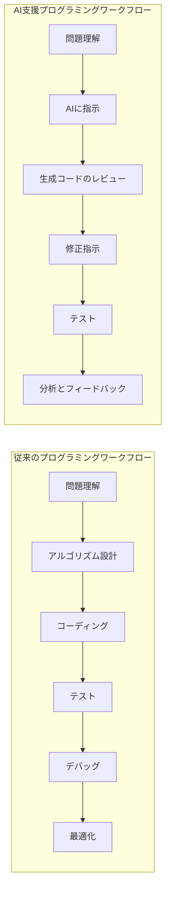

> **ベテランの知恵袋**：AIツールが登場しても、プログラミングの本質的な部分は変わりません。優れたプログラマーは、問題をどう分解し、適切な抽象化レベルを選び、トレードオフを理解する能力に長けています。AIは「どうやってコードを書くか」というタスクを支援できますが、「何を作るべきか」「なぜそれが重要か」といった質問に答えることはできません。これからのプログラマーにとって、技術的知識と同じくらい重要なのは、クリティカルシンキング、コミュニケーション能力、ドメイン知識です。AIを「道具」として効果的に使いこなし、人間にしかできない判断と創造性を発揮できるプログラマーが、これからの時代に求められています。

生成AIの登場により、プログラミング教育や入門の敷居も下がりつつあります。初心者はAIの助けを借りてコードを書き、その過程で学習することができます。

> **若手の疑問解決**：
> 
> Q: AIがコードを書けるなら、プログラミングを学ぶ意味はありますか？
> 
> A: この質問は重要です。答えは明確に「はい」です。AIツールはまだ発展途上であり、コンテキストの理解、ドメイン知識の適用、アーキテクチャの設計などには限界があります。また、AIが生成したコードを評価・修正するためには、プログラミングの基礎知識が不可欠です。さらに重要なのは、AIはあくまでツールであり、何を作るべきか、どのように設計すべきかという判断はできません。将来的には、「すべてのコードを自分で書く」必要性は減るかもしれませんが、「プログラミング的思考」「アルゴリズムの理解」「システム設計の知識」の重要性は増すでしょう。AIと効果的に協業するためには、プログラミングの原理を深く理解していることが必要なのです。

### 7.3 ローコード/ノーコードプラットフォームの台頭

生成AIの発展と並行して、「ローコード」「ノーコード」プラットフォームも急速に進化しています。これらのプラットフォームは、従来のプログラミングを必要とせず、視覚的なインターフェースを通じてアプリケーションを構築できるようにしています。

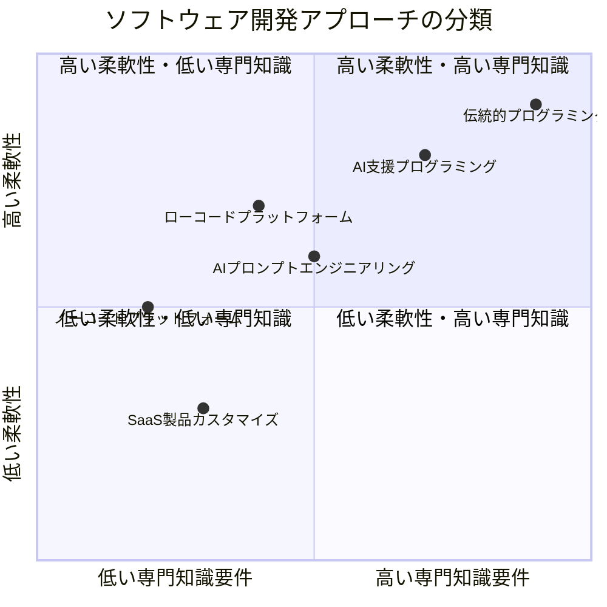

> **プロジェクト事例**：製造業の中堅企業では、ITリソースの不足から、工場の設備メンテナンス追跡システムの構築が長年の課題でした。2022年、同社は外部のプログラマーを雇う代わりに、ノーコードプラットフォームを採用。製造プロセスを深く理解している現場のエンジニアが中心となり、専用のメンテナンス追跡アプリを2ヶ月で構築しました。このアプリは設備の状態モニタリング、メンテナンススケジュール管理、問題報告ワークフローなどの機能を備えています。従来のカスタム開発と比較して、開発コストが約70%削減され、現場のニーズの変化に応じて社内チームが迅速に機能追加できるという利点がありました。この事例は、特定の用途においては、ノーコードソリューションが伝統的なプログラミングの実用的な代替となりうることを示しています。

ローコード/ノーコードプラットフォームの主な利点は、開発の民主化です。ITの専門知識がなくても、業務プロセスを深く理解している「シチズンデベロッパー」がアプリケーションを構築できるようになります。

しかし、これらのプラットフォームには柔軟性やカスタマイズ性の限界もあります。そのため、シンプルなアプリケーションや特定のドメインに特化したソリューションに最も適しています。

> **失敗から学ぶ**：2021年、あるマーケティング会社はノーコードプラットフォームを使って顧客管理システムを構築しました。当初は順調に進みましたが、ビジネスが成長するにつれて、より複雑なワークフローと外部システムとの高度な統合が必要になりました。チームはプラットフォームの制限に直面し、結局は伝統的なプログラミングによるカスタム開発に移行せざるを得ませんでした。この移行は予想以上にコストと時間を要しました。この失敗から、長期的なスケーラビリティとビジネス要件の進化を考慮した上で、開発アプローチを選択することの重要性が浮き彫りになりました。ノーコードソリューションは速いスタートを切れますが、将来の拡張性に制約がある可能性を理解しておく必要があります。

### 7.4 AIとプログラミングの未来展望

生成AIとノーコード/ローコードツールの進化により、プログラミングの世界は大きな変革期を迎えています。将来的には、以下のようなトレンドが予想されます：

1. **プログラミングの抽象度の上昇** - より高レベルの言語やインターフェースを通じたプログラミングが一般的になり、コードの詳細よりも「何をしたいか」の表現に焦点が当たるようになる

2. **AIとの協業モデルの進化** - AIは単なるコード生成ツールからより高度な「ペアプログラミングパートナー」へと進化し、問題解決プロセス全体をサポートするようになる

3. **ソフトウェア開発の民主化** - 専門的なプログラミングスキルがなくても、特定のドメインの専門家がソフトウェアを作れるようになる

4. **プログラマーの役割の専門化** - AIやローコードツールが一般的なコーディングタスクを担う一方で、プログラマーはより複雑な問題解決、アーキテクチャ設計、AIの監督といった高付加価値な役割に焦点を当てるようになる

```mermaid
graph TD
    A[現在のプログラミング] --> B[より高度な抽象化]
    A --> C[AIとの強力な協業]
    A --> D[ドメイン特化言語の進化]
    B --> E[将来のプログラミング]
    C --> E
    D --> E
    E --> F[意図ベースのプログラミング]
    E --> G[継続的なAI支援開発]
    E --> H[専門性と創造性に焦点]
```

> **コラム：プログラミングの未来：2050年のシナリオ**
> 
> 2050年、「プログラミング」という言葉の意味は大きく変わっているかもしれません。エンジニアは自然言語で目的を述べ、AIが適切なソリューションを提案します。人間の役割は、要件を明確に定義し、AIが生成したソリューションの品質と倫理的側面を評価することが中心になるでしょう。
> 
> 物理的なキーボードでコードを入力する従来のプログラミングスタイルは、芸術的表現やニッチな専門分野として残るかもしれません。ちょうど今日、手書きの手紙が特別な意味を持つようになったのと同じように。
> 
> しかし、プログラミング的思考は依然として重要なスキルであり続けるでしょう。論理的に考え、問題を分解し、システムの振る舞いを予測する能力は、AIとの効果的な協働に不可欠だからです。
> 
> 最も価値のある「プログラマー」は、特定のプログラミング言語の専門家ではなく、複雑な問題を解決し、AIの能力を最大限に引き出せる「問題解決のオーケストレーター」になるかもしれません。

### 7.5 プログラミングの本質：変わるものと変わらないもの

技術の急速な進化にもかかわらず、プログラミングの本質的な部分は変わりません。特に以下の点は、AIやノーコードツールが普及した未来でも重要であり続けるでしょう：

1. **論理的思考と問題解決能力** - 複雑な問題を分解し、段階的に解決するアプローチ

2. **抽象化と模倣化の能力** - 複雑なシステムの本質をモデル化する能力

3. **システム思考** - 部分だけでなく、全体としてのシステムの振る舞いを理解する能力

4. **ユーザーとその問題への共感** - 技術的に可能なことではなく、ユーザーが本当に必要としていることに焦点を当てる能力

> **ベテランの知恵袋**：プログラミングの世界で40年以上を過ごしてきた私が若い世代に伝えたいのは、「言語やツールは絶えず変わるが、基本原則は変わらない」ということです。私はFORTRANからPascal、C、Java、Python、そして現在のAI支援ツールまで、様々な技術の波を経験してきました。その中で気づいたのは、新しい言語やパラダイムを学ぶ能力、問題を分解する能力、そして何よりもシンプルなソリューションを見つける能力が、長期的に最も価値あるスキルだと思います。技術的な詳細よりも、これらの基本的な能力を磨くことで、どんな技術革新にも対応できるようになるのです。

---

## 第7章（続き）：生成AIの衝撃とプログラミングの未来

### 7.6 倫理的な考慮事項：AIとプログラミングの関係性

生成AIの台頭により、新たな倫理的問題も浮上しています。例えば、AIが生成したコードの著作権や責任の所在、AIによる雇用への影響、そしてAIが作成したソリューションの品質と安全性の問題などが重要なポイントです。

```mermaid
mindmap
    root((AI時代のプログラミング倫理))
        著作権と帰属
            AIが生成したコードは誰のもの？
            学習データの使用許諾
            オープンソースとの関係
        責任の問題
            バグの責任は誰にある？
            セキュリティ脆弱性の責任
            品質保証の方法
        雇用と技能
            エントリーレベルの仕事への影響
            再教育の必要性
            人間特有の価値の再定義
        教育への影響
            コピペ文化との違い
            基礎スキルの重要性
            AIリテラシーの必要性
```

> **コラム：AIによるコードの著作権は誰にあるのか？**
> 
> AIが生成したコードの著作権についての法的議論は現在進行形です。一方では、AIツールはただの道具であり、それを使用した人間に著作権があるという見方があります。これは、フォトショップを使って作成した画像の著作権が、ソフトウェアではなくアーティストにあるのと同様です。
> 
> 他方、AIは学習データから「学んだ」内容に基づいてコードを生成しており、そのデータには著作権で保護されたコードが含まれている可能性があります。これは、AIが単なるツールを超えた存在であることを示唆しています。
> 
> この問題は、特にオープンソースコミュニティで議論を巻き起こしています。特定のライセンス（GPL等）で公開されたコードをAIが学習に使用し、それに基づいて生成したコードが商用プロジェクトで使われた場合、ライセンス違反になるのでしょうか？
> 
> これらの問題に対する法的・倫理的コンセンサスはまだ形成途上であり、今後のAI技術の発展と共に議論が深まっていくことでしょう。

プログラマーとして、AIツールを使用する際は、これらの倫理的問題を意識し、責任あるアプローチを取ることが重要です。特に、AIが生成したコードを盲目的に採用するのではなく、常に批判的に評価し、その品質と安全性を確保する責任があります。

> **若手の疑問解決**：
> 
> Q: AIが私のコードを書くなら、雇用機会は減るのでしょうか？
> 
> A: この懸念は理解できますが、歴史は技術革新が雇用を破壊するというよりも、変化させる傾向があることを示しています。例えば、スプレッドシートの登場は会計士の仕事を奪うのではなく、より高付加価値な分析へとシフトさせました。AIも同様に、ルーティン的なコーディングの負担を減らし、プログラマーがより創造的な問題解決や、AIが不得意な領域（革新的なアーキテクチャ設計、複雑なアルゴリズムの最適化、ドメイン固有の問題など）に集中できるようになるでしょう。将来のプログラマーとして成功するためには、AIを効果的に活用する能力と、AIが不得意な分野での専門性を育てることが鍵となります。プログラミングの基礎と原則を深く理解していれば、ツールが変わっても適応できるでしょう。

---

## おわりに：コードなき未来へ？

この本を通して、プログラミングの歴史、様々な言語の進化、そしてプログラミングパラダイムのシフトについて探ってきました。ソースコードを一切掲載せずに、プログラミングの本質と魅力を伝えることを試みました。

プログラミングの旅は、パンチカードや物理的な配線から始まり、高水準言語、オブジェクト指向プログラミング、ウェブ開発、モバイルアプリケーション、そして今日の生成AIへと続いています。その過程で、プログラミングは常に進化し、より多くの人々がテクノロジーを創造し、形作れるように民主化されてきました。

現在、プログラミングは再び大きな変革の時を迎えています。生成AIやローコード/ノーコードプラットフォームの登場により、「プログラミング」という活動の意味そのものが再定義されつつあります。将来的には、従来のコーディングはより高レベルな抽象化の下に隠され、多くの人々がプログラミングの技術的詳細を意識することなく、ソフトウェアを創造できるようになるかもしれません。

これは「コードなき未来」の到来を意味するのでしょうか？おそらくそうではありません。むしろ、プログラミングの層が増え、異なるレベルの抽象化が共存する世界になるでしょう。一部の人々は高レベルのインターフェースやAIを通じてソフトウェアを作成し、別の人々はそれらのツールやプラットフォームを構築するために低レベルのプログラミングに従事するでしょう。

```mermaid
graph TD
    A[過去: 少数のエリートプログラマー] --> B[現在: 多様なプログラミング層]
    B --> C[未来: 層の融合と新たな役割の出現]
    
    subgraph "現在のプログラミング階層"
    D[低レベル: システムプログラマー]
    E[中レベル: アプリケーション開発者]
    F[高レベル: ローコード/ノーコード]
    end
    
    subgraph "未来のプログラミング生態系"
    G[AI支援システム設計]
    H[インテントベースプログラミング]
    I[ドメイン専門家プログラミング]
    J[AIオーケストレーション]
    end
    
    B --> G
    B --> H
    B --> I
    B --> J
```

重要なのは、プログラミングの技術的な詳細が変わっても、その根底にある原則 - 論理的思考、問題解決、抽象化能力、システム思考 - は普遍的であり続けるということです。これらのスキルを身につけることは、テクノロジーの進化に関わらず価値があります。

この本がプログラミングの旅の始まりに立つ方々に、インスピレーションと文脈を提供できることを願っています。コードを書くことは、プログラミングの1つの側面に過ぎません。その背後にある哲学、歴史、そして思考様式を理解することが、真のプログラミングの習得への道なのです。

テクノロジーは常に変化しますが、問題を解決し、世界をより良くするためにテクノロジーを活用するという人間の創造性と情熱は、いつの時代も変わらないでしょう。

---

## 付録：プログラミング学習のためのリソースガイド

本書ではソースコードを掲載していませんが、実際にプログラミングを学ぶためには、実践的な経験が不可欠です。以下に、プログラミングを学ぶための様々なリソースを紹介します。

### ソースコードなしでプログラミング思考を学ぶためのリソース

- **『考える技術と学ぶ技術』**: プログラミング的思考を養うための認知科学的アプローチ
- **『問題解決力を鍛える！アルゴリズムとデータ構造』**: アルゴリズム思考を図解で学ぶ
- **『プログラマの数学』**: プログラミングの基礎となる数学的思考法を学ぶ
- **『マッキンゼー式思考力トレーニング』**: 論理的思考とシステム思考を鍛える

### プログラミング言語の選び方

プログラミング言語の選択は、学習目的やキャリア目標によって異なります。以下は、目的別のおすすめ言語です：

#### 初心者におすすめの言語
- **Python**: 読みやすい構文と幅広い用途を持つ汎用言語
- **JavaScript**: ウェブ開発に不可欠で、視覚的なフィードバックが得やすい
- **Scratch**: ビジュアルプログラミングで概念を学ぶのに最適（特に子供向け）

#### 目的別のおすすめ言語
- **ウェブ開発**: JavaScript、TypeScript、Python（Django/Flask）、Ruby（Rails）
- **データサイエンス/AI**: Python（NumPy, Pandas, TensorFlow, PyTorch）
- **モバイルアプリ**: Swift（iOS）、Kotlin（Android）、Flutter（クロスプラットフォーム）
- **ゲーム開発**: C#（Unity）、C++（Unreal Engine）

### 学習方法とアプローチ

プログラミングを効果的に学ぶためのアプローチには、様々な方法があります：

#### 体系的な学習
- オンラインコース（Udemy、Coursera、edX、Codecademy）
- プログラミングブートキャンプ
- 大学や専門学校のコンピュータサイエンスコース

#### プロジェクトベースの学習
- 個人プロジェクトの開発
- オープンソースプロジェクトへの貢献
- ハッカソンやコーディングコンテストへの参加

#### コミュニティとの関わり
- Stack Overflowでの質問と回答
- GitHub上のプロジェクト閲覧と貢献
- 地域のコーディングミートアップやイベント
- オンラインフォーラムやDiscordコミュニティ

> **ベテランの知恵袋**：プログラミングを学ぶ最良の方法は「作りながら学ぶ」ことです。教科書やチュートリアルだけでは、実際のプロジェクトで直面する複雑さや判断の難しさを経験できません。小さなプロジェクトから始めて、徐々に複雑なものに挑戦していくことをお勧めします。また、他の人のコードを読むことも極めて重要です。優れたプログラマーは、常に他者から学び、良いパターンを取り入れ、悪いパターンを避ける方法を知っています。最後に、完璧を求めすぎないこと。「動くがまだ改善の余地がある」コードは、「完璧を目指して永遠に完成しない」コードよりもはるかに価値があります。

### AIとプログラミング学習

生成AIの時代におけるプログラミング学習には、新たなアプローチが可能になっています：

- **AIとの対話による学習**: ChatGPT、Claude、GitHub Copilotなどを使った概念理解とコーディング支援
- **AIによるコードレビュー**: 自分のコードをAIに評価してもらい、改善点を学ぶ
- **AIを使った問題解決の練習**: 特定の問題に対してAIが提案するソリューションを分析し、理解する

ただし、AIに過度に依存することなく、基本的な概念と原則を自分の力で理解することが重要です。AIはあくまで学習の補助ツールとして活用するのが最適です。

> **若手の疑問解決**：
> 
> Q: プログラミング学習で最もよくある挫折ポイントはどこですか？どう乗り越えればいいですか？
> 
> A: 多くの初学者が「初心者の壁」と呼ばれる段階で挫折します。これは基本的な構文を学んだ後、実際のプロジェクトに取り組み始めたときに発生します。急に複雑さが増し、どう進めればいいかわからなくなるのです。この壁を乗り越えるポイントは3つあります。1つ目は、小さなステップに分解すること。大きなプロジェクトではなく、達成可能な小さな目標から始めましょう。2つ目は、コミュニティに参加すること。同じ道を歩む仲間や先輩プログラマーからのサポートが心強い味方になります。3つ目は、完璧を求めないこと。最初のプロジェクトは粗削りでも構いません。作り、学び、改善するサイクルを回すことが重要です。プログラミングは技術であると同時に心理的な挑戦でもあります。粘り強く取り組む姿勢が、最終的な成功を左右します。

### プログラミング文化と歴史を学ぶためのリソース

プログラミングの技術だけでなく、その文化と歴史を理解することも、より深くプログラミングの世界を理解する助けになります：

- **『コードの未来』** by 松本行弘（Rubyの開発者）
- **『ハッカーズ：コンピュータ革命の英雄たち』** by Steven Levy
- **『CODE：ハードウェアとソフトウェアのあいだで』** by Charles Petzold
- **『プログラマが知るべき97のこと』** by 和田卓人（訳）
- **『Clean Code』** by Robert C. Martin
- **『The Pragmatic Programmer』** by Andrew Hunt & David Thomas

---

本書が、コードの背後にある思想と文化への旅の入り口となれば幸いです。プログラミングは単なる技術ではなく、世界を見る視点であり、問題を解決するためのアプローチです。その本質を理解することで、単なるコードの書き手を超えた、真のプログラマーとしての一歩を踏み出してください。

**終わり**
